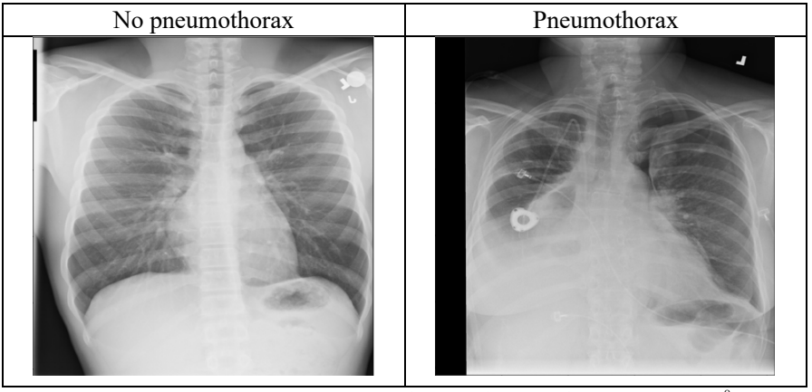
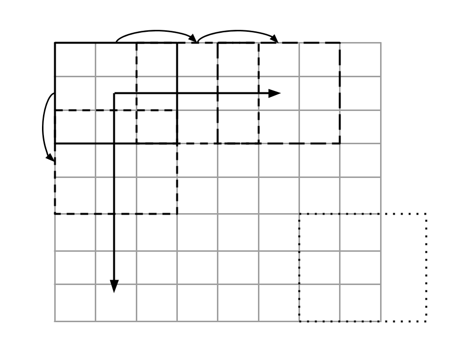
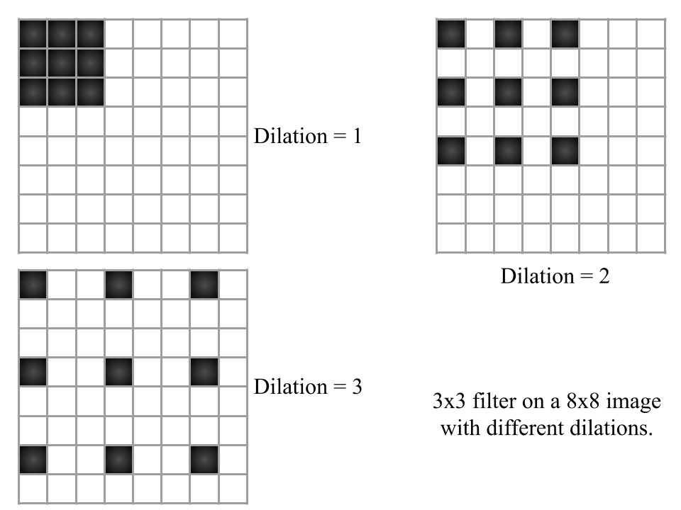
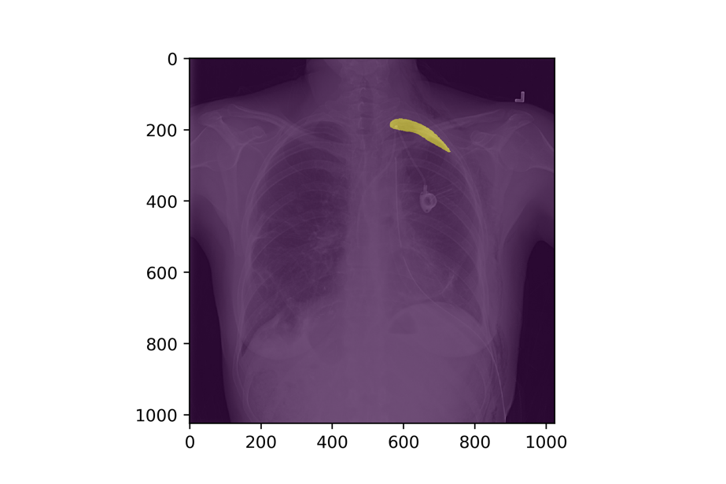

# 图像分类和分割方法

说到图像，过去几年取得了很多成就。计算机视觉的进步相当快，感觉计算机视觉的许多问题现在都更容易解决了。随着预训练模型的出现和计算成本的降低，现在在家里就能轻松训练出接近最先进水平的模型，解决大多数与图像相关的问题。但是，图像问题有许多不同的类型。从两个或多个类别的标准图像分类，到像自动驾驶汽车这样具有挑战性的问题。我们不会在本书中讨论自动驾驶汽车，但我们显然会处理一些最常见的图像问题。

我们可以对图像采用哪些不同的方法？图像只不过是一个数字矩阵。计算机无法像人类一样看到图像。它只能看到数字，这就是图像。灰度图像是一个二维矩阵，数值范围从 0 到 255。0 代表黑色，255 代表白色，介于两者之间的是各种灰色。以前，在没有深度学习的时候（或者说深度学习还不流行的时候），人们习惯于查看像素。每个像素都是一个特征。你可以在 Python 中轻松做到这一点。只需使用 OpenCV 或 Python-PIL 读取灰度图像，转换为 numpy 数组，然后将矩阵平铺（扁平化）即可。如果处理的是 RGB 图像，则需要三个矩阵，而不是一个。但思路是一样的。

```python
import numpy as np
import matplotlib.pyplot as plt
# 生成一个 256x256 的随机灰度图像，像素值在0到255之间随机分布
random_image = np.random.randint(0, 256, (256, 256))

# 创建一个新的图像窗口，设置窗口大小为7x7英寸
plt.figure(figsize=(7, 7))

# 显示生成的随机图像
# 使用灰度颜色映射 (colormap)，范围从0到255
plt.imshow(random_image, cmap='gray', vmin=0, vmax=255)

# 显示图像窗口
plt.show()
```

上面的代码使用 numpy 生成一个随机矩阵。该矩阵由 0 到 255（包含）的值组成，大小为 256x256（也称为像素）。


<p align="center"><b>图 1：二维图像阵列（单通道）及其展平版本</b> </p>

正如你所看到的，拼写后的版本只是一个大小为 M 的向量，其中 M = N * N，在本例中，这个向量的大小为 256 * 256 = 65536。

现在，如果我们继续对数据集中的所有图像进行处理，每个样本就会有 65536 个特征。我们可以在这些数据上快速建立**决策树模型、随机森林模型或基于 SVM 的模型**。这些模型将基于像素值，尝试将正样本与负样本区分开来（二元分类问题）。

你们一定都听说过猫与狗的问题，这是一个经典的问题。如果你们还记得，在评估指标一章的开头，我向你们介绍了一个气胸图像数据集。那么，让我们尝试建立一个模型来检测肺部的 X 光图像是否存在气胸。也就是说，这是一个（并不）简单的二元分类。



<p align="center"><b>图 2：非气胸与气胸 X 光图像对比</b> </p>

在图 2 中，您可以看到非气胸和气胸图像的对比。您一定已经注意到了，对于一个非专业人士（比如我）来说，要在这些图像中辨别出哪个是气胸是相当困难的。

最初的数据集是关于检测气胸的具体位置，但我们将问题修改为查找给定的 X 光图像是否存在气胸。别担心，我们将在本章介绍这个部分。数据集由 10675 张独特的图像组成，其中 2379 张有气胸（注意，这些数字是经过数据清理后得出的，因此与原始数据集不符）。正如数据科学家所说：这是一个典型的**偏斜二元分类案例**。因此，我们选择 AUC 作为评估指标，并采用分层 k 折交叉验证方案。

您可以将特征扁平化，然后尝试一些经典方法（如 SVM、RF）来进行分类，这完全没问题，但却无法让您达到最先进的水平。此外，图像大小为 1024x1024。在这个数据集上训练一个模型需要很长时间。不管怎样，让我们尝试在这些数据上建立一个简单的随机森林模型。由于图像是灰度的，我们不需要进行任何转换。我们将把图像大小调整为 256x256，使其更小，并使用之前讨论过的 AUC 作为衡量指标。

让我们看看它的表现如何。

```python
import os
import numpy as np
import pandas as pd
from PIL import Image
from sklearn import ensemble
from sklearn import metrics
from sklearn import model_selection
from tqdm import tqdm

# 定义一个函数来创建数据集
def create_dataset(training_df, image_dir):
    # 初始化空列表来存储图像数据和目标值
    images = []
    targets = []
    
    # 迭代处理训练数据集中的每一行
    for index, row in tqdm(
        training_df.iterrows(), 
        total=len(training_df), 
        desc="processing images"
    ):
        # 获取图像文件名
        image_id = row["ImageId"] 
        
        # 构建完整的图像文件路径
        image_path = os.path.join(image_dir, image_id)
        
        # 打开图像文件并进行大小调整（resize）为 256x256 像素，使用双线性插值（BILINEAR）
        image = Image.open(image_path + ".png")
        image = image.resize((256, 256), resample=Image.BILINEAR) 
        
        # 将图像转换为NumPy数组
        image = np.array(image)
        
        # 将图像扁平化为一维数组，并将其添加到图像列表
        image = image.ravel()
        images.append(image)
        
        # 将目标值（target）添加到目标列表
        targets.append(int(row["target"]))
    
    # 将图像列表转换为NumPy数组
    images = np.array(images)
    
    # 打印图像数组的形状
    print(images.shape) 
    
    # 返回图像数据和目标值
    return images, targets

if __name__ == "__main__":
    # 定义CSV文件路径和图像文件目录路径
    csv_path = "/home/abhishek/workspace/siim_png/train.csv" 
    image_path = "/home/abhishek/workspace/siim_png/train_png/"
    
    # 从CSV文件加载数据
    df = pd.read_csv(csv_path)
    
    # 添加一个名为'kfold'的列，并初始化为-1
    df["kfold"] = -1
    
    # 随机打乱数据
    df = df.sample(frac=1).reset_index(drop=True)
    
    # 获取目标值（target）
    y = df.target.values
    
    # 使用分层KFold交叉验证将数据集分成5折
    kf = model_selection.StratifiedKFold(n_splits=5)
    
    # 遍历每个折（fold）
    for f, (t_, v_) in enumerate(kf.split(X=df, y=y)): 
        df.loc[v_, 'kfold'] = f
    
    # 遍历每个折
    for fold_ in range(5):
        # 获取训练数据和测试数据
        train_df = df[df.kfold != fold_].reset_index(drop=True) 
        test_df = df[df.kfold == fold_].reset_index(drop=True)
        
        # 创建训练数据集的图像数据和目标值
        xtrain, ytrain = create_dataset(train_df, image_path)
        
        # 创建测试数据集的图像数据和目标值
        xtest, ytest = create_dataset(test_df, image_path)
        
        # 初始化一个随机森林分类器
        clf = ensemble.RandomForestClassifier(n_jobs=-1)
        
        # 使用训练数据拟合分类器
        clf.fit(xtrain, ytrain)
        
        # 使用分类器对测试数据进行预测，并获取概率值
        preds = clf.predict_proba(xtest)[:, 1]
        
        # 打印折数（fold）和AUC（ROC曲线下的面积）
        print(f"FOLD: {fold_}")
        print(f"AUC = {metrics.roc_auc_score(ytest, preds)}")
        print("")
```

平均 AUC 值约为 0.72。这还不错，但我们希望能做得更好。你可以将这种方法用于图像，这也是它在以前最常用的方法。SVM 在图像数据集方面相当有名。深度学习已被证明是解决此类问题的最先进方法，因此我们下一步可以试试它。

关于深度学习的历史以及谁发明了什么，我就不多说了。让我们看看最著名的深度学习模型之一 AlexNet。


<p align="center"><b>图 3：AlexNet 架构9 请注意，本图中的输入大小不是 224x224 而是 227x227</b> </p>

如今，你可能会说这只是一个基本的**深度卷积神经网络**，但它却是许多新型深度网络（深度神经网络）的基础。我们看到，图 3 中的网络是一个具有五个卷积层、两个密集层和一个输出层的卷积神经网络。我们看到还有最大池化。这是什么意思？让我们来看看在进行深度学习时会遇到的一些术语。



<p align="center"><b>图 4：图像大小为 8x8，滤波器大小为 3x3，步长为 2。</b> </p>

图 4 引入了两个新术语：滤波器和步长。**滤波器**是由给定函数初始化的二维矩阵，由指定函数初始化。**Kaiming正态初始化**，是卷积神经网络的最佳选择。这是因为大多数现代网络都使用 **ReLU**（整流线性单元）激活函数，需要适当的初始化来避免梯度消失问题（梯度趋近于零，网络权重不变）。该滤波器与图像进行卷积。卷积不过是滤波器与给定图像中当前重叠像素之间的元素相乘的总和。您可以在任何高中数学教科书中阅读更多关于卷积的内容。我们从图像的左上角开始对滤镜进行卷积，然后水平移动滤镜。如果移动 1 个像素，则步长为 1；如果移动 2 个像素，则步长为 2。

即使在自然语言处理中，例如在问题和回答系统中需要从大量文本语料中筛选答案时，步长也是一个非常有用的概念。当我们在水平方向上走到尽头时，就会以同样的步长垂直向下移动过滤器，从左侧开始。图 4 还显示了过滤器移出图像的情况。在这种情况下，无法计算卷积。因此，我们跳过它。如果不想跳过，则需要对图像进行**填充（pad）**。还必须注意的是，卷积会减小图像的大小。填充也是保持图像大小不变的一种方法。在图 4 中，一个 3x3 滤波器正在水平和垂直移动，每次移动都会分别跳过两列和两行（即像素）。由于它跳过了两个像素，所以步长 = 2。因此图像大小为 [(8-3) / 2] + 1 = 3.5。我们取 3.5 的下限，所以是 3x3。您可以在草稿纸上进行尝试。


<p align="center"><b>图 5：通过填充，我们可以提供与输入图像大小相同的图像</b> </p>

我们可以从图 5 中看到填充的效果。现在，我们有一个 3x3 的滤波器，它以 1 的步长移动。原始图像的大小为 6x6，我们添加了 1 的**填充**。在这种情况下，生成的图像将与输入图像大小相同，即 6x6。在处理深度神经网络时可能会遇到的另一个相关术语是**膨胀（dilation）**，如图 6 所示。



<p align="center"><b>图 6：膨胀（dilation）的例子</b> </p>

在膨胀过程中，我们将滤波器扩大 N-1，其中 N 是膨胀率的值，或简称为膨胀。在这种带膨胀的内核中，每次卷积都会跳过一些像素。这在分割任务中尤为有效。请注意，我们只讨论了二维卷积。 还有一维卷积和更高维度的卷积。它们都基于相同的基本概念。

接下来是**最大池化（Max pooling）**。最大值池只是一个返回最大值的滤波器。因此，我们提取的不是卷积，而是像素的最大值。同样，**平均池化（average pooling）**或**均值池化（mean pooling）**会返回像素的平均值。它们的使用方法与卷积核相同。池化比卷积更快，是一种对图像进行缩减采样的方法。最大池化可检测边缘，平均池化可平滑图像。

卷积神经网络和深度学习的概念太多了。我所讨论的是一些基础知识，可以帮助你入门。现在，我们已经为在 PyTorch 中构建第一个卷积神经网络做好了充分准备。PyTorch 提供了一种直观而简单的方法来实现深度神经网络，而且你不需要关心反向传播。我们用一个 python 类和一个前馈函数来定义网络，告诉 PyTorch 各层之间如何连接。在 PyTorch 中，图像符号是 BS、C、H、W，其中，BS 是批大小，C 是通道，H 是高度，W 是宽度。让我们看看 PyTorch 是如何实现 AlexNet 的。

```python
import torch
import torch.nn as nn
import torch.nn.functional as F

class AlexNet(nn.Module): 
	def __init__(self):
		super(AlexNet, self).__init__()
        self.conv1 = nn.Conv2d(
            in_channels=3, 
			out_channels=96, 
			kernel_size=11, 
			stride=4, 
			padding=0)
		self.pool1 = nn.MaxPool2d(kernel_size=3, stride=2) 
		self.conv2 = nn.Conv2d(
			in_channels=96, 
			out_channels=256, 
			kernel_size=5, 
			stride=1,
			padding=2)
		self.pool2 = nn.MaxPool2d(kernel_size=3, stride=2) 
		self.conv3 = nn.Conv2d(
			in_channels=256, 
			out_channels=384, 
			kernel_size=3, 
			stride=1,
			padding=1)
		self.conv4 = nn.Conv2d(in_channels=384,out_channels=384, 
			kernel_size=3, stride=1, padding=1)
        self.conv5 = nn.Conv2d(in_channels=384, out_channels=256,
			kernel_size=3, stride=1, padding=1)
		self.pool3 = nn.MaxPool2d(kernel_size=3, stride=2) 
		self.fc1 = nn.Linear(in_features=9216, out_features=4096)
		self.dropout1 = nn.Dropout(0.5) 
		self.fc2 = nn.Linear(in_features=4096, 
                             out_features=4096)
		self.dropout2 = nn.Dropout(0.5) 
		self.fc3 = nn.Linear(
            in_features=4096, 
            out_features=1000)
    def forward(self, image):
        bs, c, h, w = image.size()
        x = F.relu(self.conv1(image)) # size: (bs, 96, 55, 55)
        x = self.pool1(x) # size: (bs, 96, 27, 27)
        x = F.relu(self.conv2(x)) # size: (bs, 256, 27, 27)
        x = self.pool2(x) # size: (bs, 256, 13, 13)
        x = F.relu(self.conv3(x)) # size: (bs, 384, 13, 13)
        x = F.relu(self.conv4(x)) # size: (bs, 384, 13, 13)
        x = F.relu(self.conv5(x)) # size: (bs, 256, 13, 13)
        x = self.pool3(x) # size: (bs, 256, 6, 6)
        x = x.view(bs, -1) # size: (bs, 9216)
        x = F.relu(self.fc1(x)) # size: (bs, 4096)
        x = self.dropout1(x) # size: (bs, 4096) 
		# dropout does not change size
		# dropout is used for regularization
		# 0.3 dropout means that only 70% of the nodes 
		# of the current layer are used for the next layer 
		x = F.relu(self.fc2(x)) # size: (bs, 4096)
		x = self.dropout2(x) # size: (bs, 4096)
		x = F.relu(self.fc3(x)) # size: (bs, 1000)
		# 1000 is number of classes in ImageNet Dataset 
		# softmax is an activation function that converts 
		# linear output to probabilities that add up to 1
        # for each sample in the batch
		x = torch.softmax(x, axis=1) # size: (bs, 1000) 
		return x
```

如果您有一幅 3x227x227 的图像，并应用了一个大小为 11x11 的卷积滤波器，这意味着您应用了一个大小为 11x11x3 的滤波器，并与一个大小为 227x227x3 的图像进行了卷积。输出通道的数量就是分别应用于图像的相同大小的不同卷积滤波器的数量。 因此，在第一个卷积层中，输入通道是 3，也就是原始输入，即 R、G、B 三通道。PyTorch 的 torchvision 提供了许多与 AlexNet 类似的不同模型，必须指出的是，AlexNet 的实现与 torchvision 的实现并不相同。Torchvision 的 AlexNet 实现是从另一篇论文中修改而来的 AlexNet： Krizhevsky, A. One weird trick for parallelizing convolutional neural networks. CoRR, abs/1404.5997, 2014.

你可以为自己的任务设计卷积神经网络，很多时候，从零做起是个不错的主意。让我们构建一个网络，用于区分图像有无气胸。首先，让我们准备一些文件。第一步是创建一个交叉检验数据集，即 train.csv，但增加一列 kfold。我们将创建五个文件夹。在本书中，我已经演示了如何针对不同的数据集创建折叠，因此我将跳过这一部分，留作练习。对于基于 PyTorch 的神经网络，我们需要创建一个数据集类。数据集类的目的是返回一个数据项或数据样本。这个数据样本应该包含训练或评估模型所需的所有内容。

```python
import torch
import numpy as np
from PIL import Image 
from PIL import ImageFile
ImageFile.LOAD_TRUNCATED_IMAGES = True

# 定义一个数据集类，用于处理图像分类任务
class ClassificationDataset:
    def __init__(self, image_paths, targets, resize=None, augmentations=None):
        # 图像文件路径列表
        self.image_paths = image_paths
        # 目标标签列表
        self.targets = targets
        # 图像尺寸调整参数，可以为None
        self.resize = resize
        # 数据增强函数，可以为None
        self.augmentations = augmentations
        
    def __len__(self):
        # 返回数据集的大小，即图像数量
        return len(self.image_paths)
    
    def __getitem__(self, item):
        # 获取数据集中的一个样本
        image = Image.open(self.image_paths[item])
        image = image.convert("RGB")  # 将图像转换为RGB格式

        # 获取该样本的目标标签
        targets = self.targets[item]

        if self.resize is not None:
            # 如果指定了尺寸调整参数，将图像进行尺寸调整
            image = image.resize((self.resize[1], self.resize[0]),
                                 resample=Image.BILINEAR)
            image = np.array(image)

            if self.augmentations is not None:
                # 如果指定了数据增强函数，应用数据增强
                augmented = self.augmentations(image=image)
                image = augmented["image"]

            # 将图像通道顺序调整为(C, H, W)的形式，并转换为float32类型
            image = np.transpose(image, (2, 0, 1)).astype(np.float32)

        # 返回样本，包括图像和对应的目标标签
        return {
            "image": torch.tensor(image, dtype=torch.float),
            "targets": torch.tensor(targets, dtype=torch.long),
        }

```

现在我们需要 engine.py。engine.py 包含训练和评估功能。让我们看看 engine.py 是如何编写的。

```python
import torch
import torch.nn as nn
from tqdm import tqdm

# 用于训练模型的函数
def train(data_loader, model, optimizer, device):
    # 将模型设置为训练模式
    model.train()
    for data in data_loader:
        # 从数据加载器中提取输入图像和目标标签
        inputs = data["image"]
        targets = data["targets"]
        
        # 将输入和目标移动到指定的设备（例如，GPU）
        inputs = inputs.to(device, dtype=torch.float)
        targets = targets.to(device, dtype=torch.float)
        
        # 将优化器中的梯度归零
        optimizer.zero_grad()
        
        # 前向传播：计算模型预测
        outputs = model(inputs)
        
        # 使用带逻辑斯蒂函数的二元交叉熵损失计算损失
        loss = nn.BCEWithLogitsLoss()(outputs, targets.view(-1, 1))
        
        # 反向传播：计算梯度并更新模型权重
        loss.backward()
        optimizer.step()

# 用于评估模型的函数
def evaluate(data_loader, model, device):
    # 将模型设置为评估模式（不进行梯度计算）
    model.eval()
    
    # 初始化列表以存储真实目标和模型预测
    final_targets = []
    final_outputs = []
    
    with torch.no_grad():
        for data in data_loader:
            # 从数据加载器中提取输入图像和目标标签
            inputs = data["image"]
            targets = data["targets"]
            
            # 将输入移动到指定的设备（例如，GPU）
            inputs = inputs.to(device, dtype=torch.float)
            
            # 获取模型预测
            output = model(inputs)
            
            # 将目标和输出转换为CPU和Python列表
            targets = targets.detach().cpu().numpy().tolist()
            output = output.detach().cpu().numpy().tolist()
            
            # 将列表扩展以包含批次数据
            final_targets.extend(targets)
            final_outputs.extend(output)
    
    # 返回最终的模型预测和真实目标
    return final_outputs, final_targets

```

有了 engine.py，就可以创建一个新文件：model.py。model.py 将包含我们的模型。把模型与训练分开是个好主意，因为这样我们就可以轻松地试验不同的模型和不同的架构。名为 pretrainedmodels 的 PyTorch 库中有很多不同的模型架构，如 AlexNet、ResNet、DenseNet 等。这些不同的模型架构是在名为 ImageNet 的大型图像数据集上训练出来的。在 ImageNet 上训练后，我们可以使用它们的权重，也可以不使用这些权重。如果我们不使用 ImageNet 权重进行训练，这意味着我们的网络将从头开始学习一切。这就是 model.py 的样子。

```python
import torch.nn as nn
import pretrainedmodels

# 定义一个函数以获取模型
def get_model(pretrained):
    if pretrained:
        # 使用预训练的 AlexNet 模型，加载在 ImageNet 数据集上训练的权重
        model = pretrainedmodels.__dict__["alexnet"](pretrained='imagenet')
    else:
        # 使用未经预训练的 AlexNet 模型
        model = pretrainedmodels.__dict__["alexnet"](pretrained=None)
    
    # 修改模型的最后一层全连接层，以适应特定任务
    model.last_linear = nn.Sequential(
        nn.BatchNorm1d(4096),  # 批归一化层
        nn.Dropout(p=0.25),  # 随机失活层，防止过拟合
        nn.Linear(in_features=4096, out_features=2048),  # 连接层
        nn.ReLU(),  # ReLU 激活函数
        nn.BatchNorm1d(2048, eps=1e-05, momentum=0.1),  # 批归一化层
        nn.Dropout(p=0.5),  # 随机失活层
        nn.Linear(in_features=2048, out_features=1)  # 最终的二元分类层
    )
    
    return model

```

如果你打印了网络，会得到如下输出：

```python
AlexNet(
	(avgpool): AdaptiveAvgPool2d(output_size=(6, 6)) 
	(_features): Sequential(
        (0): Conv2d(3, 64, kernel_size=(11, 11), stride=(4, 4), padding=(2,2))
		(1): ReLU(inplace=True)
		(2): MaxPool2d(kernel_size=3, stride=2, padding=0, dilation=1, ceil_mode=False)
		(3): Conv2d(64, 192, kernel_size=(5, 5), stride=(1, 1), padding=(2,2))
		(4): ReLU(inplace=True)
		(5): MaxPool2d(kernel_size=3, stride=2, padding=0, dilation=1, ceil_mode=False)
		(6): Conv2d(192, 384, kernel_size=(3, 3), stride=(1, 1), padding=(1,1))
		(7): ReLU(inplace=True)
		(8): Conv2d(384, 256, kernel_size=(3, 3), stride=(1, 1), padding=(1,1))
		(9): ReLU(inplace=True)
		(10): Conv2d(256, 256, kernel_size=(3, 3), stride=(1, 1), padding=(1,1))
		(11): ReLU(inplace=True)
		(12): MaxPool2d(kernel_size=3, stride=2, padding=0, dilation=1, eil_mode=False))
	(dropout0): Dropout(p=0.5, inplace=False)
	(linear0): Linear(in_features=9216, out_features=4096, bias=True) 
	(relu0): ReLU(inplace=True)
	(dropout1): Dropout(p=0.5, inplace=False)
	(linear1): Linear(in_features=4096, out_features=4096, bias=True) 
	(relu1): ReLU(inplace=True)
	(last_linear): Sequential(
		(0): BatchNorm1d(4096, eps=1e-05, momentum=0.1, affine=True, rack_running_stats=True)
		(1): Dropout(p=0.25, inplace=False)
		(2): Linear(in_features=4096, out_features=2048, bias=True)
		(3): ReLU()
		(4): BatchNorm1d(2048, eps=1e-05, momentum=0.1, affine=True, 
track_running_stats=True)
		(5): Dropout(p=0.5, inplace=False)
		(6): Linear(in_features=2048, out_features=1, bias=True) 
	)
)
```

现在，万事俱备，可以开始训练了。我们将使用 train.py 训练模型。

```python
import os
import pandas as pd
import numpy as np
import albumentations
import torch
from sklearn import metrics
from sklearn.model_selection import train_test_split
import dataset
import engine
from model import get_model

if __name__ == "__main__":
    # 定义数据路径、设备、迭代次数
    data_path = "/home/abhishek/workspace/siim_png/"
    device = "cuda"  # 使用GPU加速
    epochs = 10

    # 从CSV文件读取数据
    df = pd.read_csv(os.path.join(data_path, "train.csv"))
    images = df.ImageId.values.tolist()
    images = [os.path.join(data_path, "train_png", i + ".png") for i in images]
    targets = df.target.values

    # 获取预训练的模型
    model = get_model(pretrained=True)
    model.to(device)

    # 定义均值和标准差，用于数据标准化
    mean = (0.485, 0.456, 0.406)
    std = (0.229, 0.224, 0.225)

    # 数据增强，将图像标准化
    aug = albumentations.Compose(
        [
            albumentations.Normalize(
                mean, std, max_pixel_value=255.0, always_apply=True
            )
        ]
    )

    # 划分训练集和验证集
    train_images, valid_images, train_targets, valid_targets = train_test_split(
        images, targets, stratify=targets, random_state=42
    )

    # 创建训练数据集和验证数据集
    train_dataset = dataset.ClassificationDataset(
        image_paths=train_images,
        targets=train_targets,
        resize=(227, 227),
        augmentations=aug,
    )

    # 创建训练数据加载器
    train_loader = torch.utils.data.DataLoader(
        train_dataset, batch_size=16, shuffle=True, num_workers=4
    )

    # 创建验证数据集
    valid_dataset = dataset.ClassificationDataset(
        image_paths=valid_images,
        targets=valid_targets,
        resize=(227, 227),
        augmentations=aug,
    )

    # 创建验证数据加载器
    valid_loader = torch.utils.data.DataLoader(
        valid_dataset, batch_size=16, shuffle=False, num_workers=4
    )

    # 定义优化器
    optimizer = torch.optim.Adam(model.parameters(), lr=5e-4)

    # 训练循环
    for epoch in range(epochs):
        # 训练模型
        engine.train(train_loader, model, optimizer, device=device)

        # 评估模型性能
        predictions, valid_targets = engine.evaluate(
            valid_loader, model, device=device
        )

        # 计算ROC AUC分数并打印
        roc_auc = metrics.roc_auc_score(valid_targets, predictions)
        print(f"Epoch={epoch}, Valid ROC AUC={roc_auc}")

```

让我们在没有预训练权重的情况下进行训练：

```python
Epoch=0, Valid ROC AUC=0.5737161981475328
Epoch=1, Valid ROC AUC=0.5362868001588292
Epoch=2, Valid ROC AUC=0.6163448214387008
Epoch=3, Valid ROC AUC=0.6119219143780944
Epoch=4, Valid ROC AUC=0.6229718888519726
Epoch=5, Valid ROC AUC=0.5983014999635341
Epoch=6, Valid ROC AUC=0.5523236874306134
Epoch=7, Valid ROC AUC=0.4717721611306046
Epoch=8, Valid ROC AUC=0.6473408263980617
Epoch=9, Valid ROC AUC=0.6639862888260415
```

 AUC 约为 0.66，甚至低于我们的随机森林模型。使用预训练权重会发生什么情况？

```python
Epoch=0, Valid ROC AUC=0.5730387429803165
Epoch=1, Valid ROC AUC=0.5319813942934937
Epoch=2, Valid ROC AUC=0.627111577514323
Epoch=3, Valid ROC AUC=0.6819736959393209
Epoch=4, Valid ROC AUC=0.5747117168950512
Epoch=5, Valid ROC AUC=0.5994619255609669
Epoch=6, Valid ROC AUC=0.5080889443530546
Epoch=7, Valid ROC AUC=0.6323792776512727
Epoch=8, Valid ROC AUC=0.6685753182661686
Epoch=9, Valid ROC AUC=0.6861802387300147
```

现在的 AUC 好了很多。不过，它仍然较低。预训练模型的好处是可以轻松尝试多种不同的模型。让我们试试使用预训练权重的 **resnet18**。

```python
import torch.nn as nn
import pretrainedmodels

# 定义一个函数以获取模型
def get_model(pretrained):
    if pretrained:
        # 使用预训练的 ResNet-18 模型，加载在 ImageNet 数据集上训练的权重
        model = pretrainedmodels.__dict__["resnet18"](pretrained='imagenet')
    else:
        # 使用未经预训练的 ResNet-18 模型
        model = pretrainedmodels.__dict__["resnet18"](pretrained=None)

    # 修改模型的最后一层全连接层，以适应特定任务
    model.last_linear = nn.Sequential(
        nn.BatchNorm1d(512),  # 批归一化层
        nn.Dropout(p=0.25),  # 随机失活层，防止过拟合
        nn.Linear(in_features=512, out_features=2048),  # 连接层
        nn.ReLU(),  # ReLU 激活函数
        nn.BatchNorm1d(2048, eps=1e-05, momentum=0.1),  # 批归一化层
        nn.Dropout(p=0.5),  # 随机失活层
        nn.Linear(in_features=2048, out_features=1)  # 最终的二元分类层
    )
    
    return model

```

在尝试该模型时，我还将图像大小改为 512x512，并添加了一个学习率调度器，每 3 个epochs后将学习率乘以 0.5。

```python
Epoch=0, Valid ROC AUC=0.5988225569880796
Epoch=1, Valid ROC AUC=0.730349343208836
Epoch=2, Valid ROC AUC=0.5870943169939142
Epoch=3, Valid ROC AUC=0.5775864444138311
Epoch=4, Valid ROC AUC=0.7330502499939224
Epoch=5, Valid ROC AUC=0.7500336296524395
Epoch=6, Valid ROC AUC=0.7563722113724951
Epoch=7, Valid ROC AUC=0.7987463837994215
Epoch=8, Valid ROC AUC=0.798505708937384
Epoch=9, Valid ROC AUC=0.8025477500546988
```

这个模型似乎表现最好。不过，您可以调整 AlexNet 中的不同参数和图像大小，以获得更好的分数。 使用增强技术将进一步提高得分。优化深度神经网络很难，但并非不可能。选择 Adam 优化器、使用低学习率、在验证损失达到高点时降低学习率、尝试一些增强技术、尝试对图像进行预处理（如在需要时进行裁剪，这也可视为预处理）、改变批次大小等。你可以做很多事情来优化深度神经网络。

与 AlexNet 相比，**ResNet** 的结构要复杂得多。ResNet 是残差神经网络（Residual Neural Network）的缩写，由 K. He、X. Zhang、S. Ren 和 J. Sun 在 2015 年发表的论文中提出。ResNet 由**残差块**（residual blocks）组成，通过跳过某些层，使知识能够不断在各层中进行传递。这些层之间的 连接被称为**跳跃连接**（skip-connections），因为我们跳过了一层或多层。跳跃连接通过将梯度传播到更多层来帮助解决梯度消失问题。这样，我们就可以训练非常大的卷积神经网络，而不会损失性能。通常情况下，如果我们使用的是大型神经网络，那么当训练到某一节点上时训练损失反而会增加，但这可以通过使用跳跃连接来避免。通过图 7 可以更好地理解这一点。


<p align="center"><b>图 7：简单连接与残差连接的比较。参见跳跃连接。请注意，本图省略了最后一层。</b> </p>

残差块非常容易理解。你从某一层获取输出，跳过一些层，然后将输出添加到网络中更远的一层。虚线表示输入形状需要调整，因为使用了最大池化，而最大池化的使用会改变输出的大小。

ResNet 有多种不同的版本： 有 18 层、34 层、50 层、101 层和 152 层，所有这些层都在 ImageNet 数据集上进行了权重预训练。如今，预训练模型（几乎）适用于所有情况，但请确保您从较小的模型开始，例如，从 resnet-18 开始，而不是 resnet-50。其他一些 ImageNet 预训练模型包括：

- Inception
- DenseNet(different variations)

- NASNet 
- PNASNet 
- VGG 
- Xception 
- ResNeXt
- EfficientNet, etc.

大部分预训练的最先进模型可以在 GitHub 上的 pytorch- pretrainedmodels 资源库中找到：https://github.com/Cadene/pretrained-models.pytorch。详细讨论这些模型不在本章（和本书）范围之内。既然我们只关注应用，那就让我们看看这样的预训练模型如何用于分割任务。


<p align="center"><b>图 8：U-Net架构</b> </p>

分割（Segmentation）是计算机视觉中相当流行的一项任务。在分割任务中，我们试图从背景中移除/提取前景。 前景和背景可以有不同的定义。我们也可以说，这是一项像素分类任务，你的工作是给给定图像中的每个像素分配一个类别。事实上，我们正在处理的气胸数据集就是一项分割任务。在这项任务中，我们需要对给定的胸部放射图像进行气胸分割。用于分割任务的最常用模型是 U-Net。其结构如图 8 所示。

U-Net 包括两个部分：编码器和解码器。编码器与您目前所见过的任何 U-Net 都是一样的。解码器则有些不同。解码器由上卷积层组成。在上卷积（up-convolutions）（**转置卷积**transposed convolutions）中，我们使用滤波器，当应用到一个小图像时，会产生一个大图像。在 PyTorch 中，您可以使用 ConvTranspose2d 来完成这一操作。必须注意的是，上卷积与上采样并不相同。上采样是一个简单的过程，我们在图像上应用一个函数来调整它的大小。在上卷积中，我们要学习滤波器。我们将编码器的某些部分作为某些解码器的输入。这对 上卷积层非常重要。

让我们看看 U-Net 是如何实现的。

```python
import torch
import torch.nn as nn
from torch.nn import functional as F

# 定义一个双卷积层
def double_conv(in_channels, out_channels): 
    conv = nn.Sequential(
        nn.Conv2d(in_channels, out_channels, kernel_size=3), 
        nn.ReLU(inplace=True),
        nn.Conv2d(out_channels, out_channels, kernel_size=3), 
        nn.ReLU(inplace=True)
    )
    return conv

# 定义函数用于裁剪输入张量
def crop_tensor(tensor, target_tensor):
    target_size = target_tensor.size()[2] 
    tensor_size = tensor.size()[2] 
    delta = tensor_size - target_size 
    delta = delta // 2
    return tensor[:, :, delta:tensor_size - delta, delta:tensor_size - delta]

# 定义 U-Net 模型
class UNet(nn.Module):
    def __init__(self):
        super(UNet, self).__init()
        
        # 定义池化层，编码器和解码器的双卷积层
        self.max_pool_2x2 = nn.MaxPool2d(kernel_size=2, stride=2)
        self.down_conv_1 = double_conv(1, 64)
        self.down_conv_2 = double_conv(64, 128)
        self.down_conv_3 = double_conv(128, 256)
        self.down_conv_4 = double_conv(256, 512)
        self.down_conv_5 = double_conv(512, 1024)
        
        # 定义上采样层和解码器的双卷积层
        self.up_trans_1 = nn.ConvTranspose2d(in_channels=1024, out_channels=512, kernel_size=2, stride=2)
        self.up_conv_1 = double_conv(1024, 512) 
        self.up_trans_2 = nn.ConvTranspose2d(in_channels=512, out_channels=256, kernel_size=2, stride=2)
        self.up_conv_2 = double_conv(512, 256) 
        self.up_trans_3 = nn.ConvTranspose2d(in_channels=256, out_channels=128, kernel_size=2, stride=2)
        self.up_conv_3 = double_conv(256, 128) 
        self.up_trans_4 = nn.ConvTranspose2d(in_channels=128, out_channels=64, kernel_size=2, stride=2)
        self.up_conv_4 = double_conv(128, 64) 
        
        # 定义输出层
        self.out = nn.Conv2d(in_channels=64, out_channels=2, kernel_size=1)
    
    def forward(self, image): 
        # 编码器部分
        x1 = self.down_conv_1(image)
        x2 = self.max_pool_2x2(x1)
        x3 = self.down_conv_2(x2)
        x4 = self.max_pool_2x2(x3)
        x5 = self.down_conv_3(x4)
        x6 = self.max_pool_2x2(x5)
        x7 = self.down_conv_4(x6)
        x8 = self.max_pool_2x2(x7)
        x9 = self.down_conv_5(x8)
        
        # 解码器部分
        x = self.up_trans_1(x9) 
        y = crop_tensor(x7, x)
        x = self.up_conv_1(torch.cat([x, y], axis=1)) 
        x = self.up_trans_2(x)
        y = crop_tensor(x5, x)
        x = self.up_conv_2(torch.cat([x, y], axis=1)) 
        x = self.up_trans_3(x)
        y = crop_tensor(x3, x)
        x = self.up_conv_3(torch.cat([x, y], axis=1)) 
        x = self.up_trans_4(x)
        y = crop_tensor(x1, x)
        x = self.up_conv_4(torch.cat([x, y], axis=1))
        
        # 输出层
        out = self.out(x) 
        return out

if __name__ == "__main__":
    image = torch.rand((1, 1, 572, 572)) 
    model = UNet()
    print(model(image))

```

请注意，我上面展示的 U-Net 实现是 U-Net 论文的原始实现。互联网上有很多不同的实现方法。 有些人喜欢使用双线性采样代替转置卷积进行上采样，但这并不是论文的真正实现。不过，它的性能可能会更好。在上图所示的原始实现中，有一个单通道图像，输出中有两个通道：一个是前景，一个是背景。正如你所看到的，这可以很容易地为任意数量的类和任意数量的输入通道进行定制。在此实现中，输入图像的大小与输出图像的大小不同，因为我们使用的是无填充卷积（convolutions without padding）。

我们可以看到，U-Net 的编码器部分只是一个简单的卷积网络。 因此，我们可以用任何网络（如 ResNet）来替换它。 这种替换也可以通过预训练权重来完成。因此，我们可以使用基于 ResNet 的编码器，该编码器已在 ImageNet 和通用解码器上进行了预训练。我们可以使用多种不同的网络架构来代替 ResNet。Pavel Yakubovskiy 所著的《Segmentation Models Pytorch》就是许多此类变体的实现，其中编码器可以被预训练模型所取代。让我们应用基于 ResNet 的 U-Net 来解决气胸检测问题。

大多数类似的问题都有两个输入：原始图像和掩码（mask）。 如果有多个对象，就会有多个掩码。 在我们的气胸数据集中，我们得到的是 RLE。RLE 代表运行长度编码，是一种表示二进制掩码以节省空间的方法。深入研究 RLE 超出了本章的范围。因此，假设我们有一张输入图像和相应的掩码。让我们先设计一个数据集类，用于输出图像和掩码图像。请注意，我们创建的脚本几乎可以应用于任何分割问题。训练数据集是一个 CSV 文件，只包含图像 ID（也是文件名）。

```python
import os
import glob
import torch
import numpy as np
import pandas as pd
from PIL import Image, ImageFile
from tqdm import tqdm
from collections import defaultdict
from torchvision import transforms
from albumentations import (Compose,
                            OneOf,
                            RandomBrightnessContrast, 
                            RandomGamma,
                            ShiftScaleRotate, )

# 设置PIL图像加载截断的处理
ImageFile.LOAD_TRUNCATED_IMAGES = True

# 创建SIIM数据集类
class SIIMDataset(torch.utils.data.Dataset):
    def __init__(self, image_ids, transform=True, preprocessing_fn=None):
        self.data = defaultdict(dict)
        self.transform = transform
        self.preprocessing_fn = preprocessing_fn
        
        # 定义数据增强
        self.aug = Compose(
            [ShiftScaleRotate(
                shift_limit=0.0625,
                scale_limit=0.1,
                rotate_limit=10, p=0.8
            ),
             OneOf(
                 [
                     RandomGamma(
                         gamma_limit=(90, 110) 
                     ),
                     RandomBrightnessContrast( 
                         brightness_limit=0.1, 
                         contrast_limit=0.1
                     ), 
                 ], 
                 p=0.5,
             ), 
            ]
        )
        
        # 构建数据字典，其中包含图像和掩码的路径信息
        for imgid in image_ids:
            files = glob.glob(os.path.join(TRAIN_PATH, imgid, "*.png")) 
            self.data[counter] = {
                "img_path": os.path.join( 
                    TRAIN_PATH, imgid + ".png"
                ),
                "mask_path": os.path.join(
                    TRAIN_PATH, imgid + "_mask.png" 
                ),
            }

    def __len__(self):
        return len(self.data)
    
    def __getitem__(self, item):
        img_path = self.data[item]["img_path"] 
        mask_path = self.data[item]["mask_path"]
        
        # 打开图像并将其转换为RGB模式
        img = Image.open(img_path) 
        img = img.convert("RGB")
        img = np.array(img)
        
        # 打开掩码图像，并将其转换为浮点数
        mask = Image.open(mask_path)
        mask = (mask >= 1).astype("float32")
        
        # 如果需要进行数据增强
        if self.transform is True:
            augmented = self.aug(image=img, mask=mask) 
            img = augmented["image"]
            mask = augmented["mask"]
        
        # 应用预处理函数（如果有）
        img = self.preprocessing_fn(img)
        
        # 返回图像和掩码
        return {
            "image": transforms.ToTensor()(img),
            "mask": transforms.ToTensor()(mask).float(), 
        }

```

有了数据集类之后，我们就可以创建一个训练函数。

```python
import os
import sys
import torch
import numpy as np
import pandas as pd
import segmentation_models_pytorch as smp
import torch.nn as nn
import torch.optim as optim
from apex import amp
from collections import OrderedDict
from sklearn import model_selection
from tqdm import tqdm
from torch.optim import lr_scheduler
from dataset import SIIMDataset

# 定义训练数据集CSV文件路径
TRAINING_CSV = "../input/train_pneumothorax.csv" 
# 定义训练和测试的批量大小
TRAINING_BATCH_SIZE = 16 
TEST_BATCH_SIZE = 4
# 定义训练的时期数
EPOCHS = 10
# 指定使用的编码器和权重
ENCODER = "resnet18"
ENCODER_WEIGHTS = "imagenet"
# 指定设备（GPU）
DEVICE = "cuda"

# 定义训练函数
def train(dataset, data_loader, model, criterion, optimizer): 
    model.train()
    num_batches = int(len(dataset) / data_loader.batch_size)
    tk0 = tqdm(data_loader, total=num_batches)
    for d in tk0:
        inputs = d["image"] 
        targets = d["mask"]
        inputs = inputs.to(DEVICE, dtype=torch.float)
        targets = targets.to(DEVICE, dtype=torch.float)
        optimizer.zero_grad()
        outputs = model(inputs)
        loss = criterion(outputs, targets)
        with amp.scale_loss(loss, optimizer) as scaled_loss: 
            scaled_loss.backward()
        optimizer.step()
    tk0.close()

# 定义评估函数
def evaluate(dataset, data_loader, model): 
    model.eval()
    final_loss = 0
    num_batches = int(len(dataset) / data_loader.batch_size) 
    tk0 = tqdm(data_loader, total=num_batches)
    with torch.no_grad():
        for d in tk0:
            inputs = d["image"] 
            targets = d["mask"]
            inputs = inputs to (DEVICE, dtype=torch.float) 
            targets = targets.to(DEVICE, dtype=torch.float) 
            output = model(inputs)
            loss = criterion(output, targets)
            final_loss += loss
        tk0.close()
        return final_loss / num_batches

if __name__ == "__main__":
    df = pd.read_csv(TRAINING_CSV)
    df_train, df_valid = model_selection.train_test_split( 
        df, random_state=42, test_size=0.1
    )
    training_images = df_train.image_id.values 
    validation_images = df_valid.image_id.values
    
    # 创建 U-Net 模型
    model = smp.Unet(
        encoder_name=ENCODER,
        encoder_weights=ENCODER_WEIGHTS, 
        classes=1,
        activation=None, 
    )
    
    # 获取数据预处理函数
    prep_fn = smp.encoders.get_preprocessing_fn( 
        ENCODER,
        ENCODER_WEIGHTS 
    )
    
    # 将模型放在设备上
    model.to(DEVICE)
    
    # 创建训练数据集
    train_dataset = SIIMDataset( 
        training_images, 
        transform=True, 
        preprocessing_fn=prep_fn,
    )
    
    # 创建训练数据加载器
    train_loader = torch.utils.data.DataLoader( 
        train_dataset,
        batch_size=TRAINING_BATCH_SIZE, 
        shuffle=True,
        num_workers=12 
    )
    
    # 创建验证数据集
    valid_dataset = SIIMDataset( 
        validation_images, 
        transform=False, 
        preprocessing_fn=prep_fn,
    )
    
    # 创建验证数据加载器
    valid_loader = torch.utils.data.DataLoader( 
        valid_dataset,
        batch_size=TEST_BATCH_SIZE, 
        shuffle=True,
        num_workers=4 
    )
    
    # 定义优化器
    optimizer = torch.optim.Adam(model.parameters(), lr=1e-3) 
    
    # 定义学习率调度器
    scheduler = lr_scheduler.ReduceLROnPlateau( 
        optimizer, mode="min", patience=3, verbose=True
    )
    
    # 初始化 Apex 混合精度训练
    model, optimizer = amp.initialize(
        model, optimizer, opt_level="O1", verbosity=0 
    )
    
    # 如果有多个GPU，则使用 DataParallel 进行并行训练
    if torch.cuda.device_count() > 1:
        print(f"Let's use {torch.cuda.device_count()} GPUs!") 
        model = nn.DataParallel(model)
    
    # 输出训练相关的信息
    print(f"Training batch size: {TRAINING_BATCH_SIZE}")
    print(f"Test batch size: {TEST_BATCH_SIZE}")
    print(f"Epochs: {EPOCHS}")
    print(f"Image size: {IMAGE_SIZE}")
    print(f"Number of training images: {len(train_dataset)}")
    print(f"Number of validation images: {len(valid_dataset)}")
    print(f"Encoder: {ENCODER}")

    # 循环训练多个时期
    for epoch in range(EPOCHS):
        print(f"Training Epoch: {epoch}") 
        train(
            train_dataset, 
            train_loader, 
            model, 
            criterion, 
            optimizer
        )
        print(f"Validation Epoch: {epoch}") 
        val_log = evaluate( 
            valid_dataset, 
            valid_loader, 
            model
        )
        scheduler.step(val_log["loss"]) 
        print("\n")

```

在分割问题中，你可以使用各种损失函数，例如二元交叉熵、focal损失、dice损失等。我把这个问题留给 读者根据评估指标来决定合适的损失。当训练这样一个模型时，您将建立预测气胸位置的模型，如图 9 所示。在上述代码中，我们使用英伟达 apex 进行了混合精度训练。请注意，从 PyTorch 1.6.0+ 版本开始，PyTorch 本身就提供了这一功能。



<p align="center"><b>图 9：从训练有素的模型中检测到气胸的示例（可能不是正确预测）。</b> </p>

我在一个名为 "Well That's Fantastic Machine Learning (WTFML) "的 python 软件包中收录了一些常用函数。让我们看看它如何帮助我们为 FGVC 202013 植物病理学挑战赛中的植物图像建立多类分类模型。

```python
import os
import pandas as pd
import numpy as np
import albumentations
import argparse
import torch
import torchvision
import torch.nn as nn
import torch.nn.functional as F
from sklearn import metrics
from sklearn.model_selection import train_test_split
from wtfml.engine import Engine
from wtfml.data_loaders.image import ClassificationDataLoader

# 自定义损失函数，实现密集交叉熵
class DenseCrossEntropy(nn.Module): 
    def __init__(self):
        super(DenseCrossEntropy, self).__init__() 
        
    def forward(self, logits, labels):
        logits = logits.float() 
        labels = labels.float()
        logprobs = F.log_softmax(logits, dim=-1) 
        loss = -labels * logprobs
        loss = loss.sum(-1) 
        return loss.mean()

# 自定义神经网络模型
class Model(nn.Module): 
    def __init__(self):
        super().__init()
        self.base_model = torchvision.models.resnet18(pretrained=True) 
        in_features = self.base_model.fc.in_features
        self.out = nn.Linear(in_features, 4) 

    def forward(self, image, targets=None):
        batch_size, C, H, W = image.shape
        x = self.base_model.conv1(image)
        x = self.base_model.bn1(x)
        x = self.base_model.relu(x)
        x = self.base_model.maxpool(x)
        x = self.base_model.layer1(x)
        x = self.base_model.layer2(x)
        x = self.base_model.layer3(x)
        x = self.base_model.layer4(x)
        x = F.adaptive_avg_pool2d(x, 1).reshape(batch_size, -1)
        x = self.out(x)
        loss = None
        if targets is not None:
            loss = DenseCrossEntropy()(x, targets.type_as(x)) 
        return x, loss

if __name__ == "__main__":
    # 命令行参数解析器
    parser = argparse.ArgumentParser() 
    parser.add_argument("--data_path", type=str, )
    parser.add_argument("--device", type=str,)
    parser.add_argument("--epochs", type=int,)
    args = parser.parse_args()
    
    # 从CSV文件加载数据
    df = pd.read_csv(os.path.join(args.data_path, "train.csv")) 
    images = df.image_id.values.tolist()
    images = [os.path.join(args.data_path, "images", i + ".jpg") for i in images]
    targets = df[["healthy", "multiple_diseases", "rust", "scab"]].values 
    
    # 创建神经网络模型
    model = Model()
    model.to(args.device)
    
    # 定义均值和标准差以及数据增强
    mean = (0.485, 0.456, 0.406)
    std = (0.229, 0.224, 0.225)
    aug = albumentations.Compose( 
        [
            albumentations.Normalize(
                mean, 
                std,
                max_pixel_value=255.0, 
                always_apply=True
            ) 
        ]
    ) 
    
    # 分割训练集和验证集
    (
        train_images, valid_images, 
        train_targets, valid_targets
    ) = train_test_split(images, targets) 

    # 创建训练数据加载器
    train_loader = ClassificationDataLoader(
        image_paths=train_images, 
        targets=train_targets, 
        resize=(128, 128), 
        augmentations=aug,
    ).fetch(
        batch_size=16, 
        num_workers=4, 
        drop_last=False, 
        shuffle=True, 
        tpu=False
    )
    
    # 创建验证数据加载器
    valid_loader = ClassificationDataLoader( 
        image_paths=valid_images,
        targets=valid_targets, 
        resize=(128, 128), 
        augmentations=aug,
    ).fetch(
        batch_size=16, 
        num_workers=4, 
        drop_last=False, 
        shuffle=False, 
        tpu=False
    )

    # 创建优化器
    optimizer = torch.optim.Adam(model.parameters(), lr=5e-4) 
    
    # 创建学习率调度器
    scheduler = torch.optim.lr_scheduler.StepLR(
        optimizer, step_size=15, gamma=0.6 
    )
    
    # 循环训练多个时期
    for epoch in range(args.epochs): 
        # 训练模型
        train_loss = Engine.train(
            train_loader, model, optimizer, device=args.device 
        )
        # 评估模型
        valid_loss = Engine.evaluate(
            valid_loader, model, device=args.device 
        )
        # 打印损失信息
        print(f"{epoch}, Train Loss={train_loss} Valid Loss={valid_loss}")

```

有了数据后，就可以运行脚本了： 

```shell
python plant.py --data_path ../../plant_pathology --device cuda -- 
epochs 2
100%|█████████████| 86/86 [00:12<00:00, 6.73it/s, loss=0.723] 
100%|█████████████ 29/29 [00:04<00:00, 6.62it/s, loss=0.433] 
0, Train Loss=0.7228777609592261 Valid Loss=0.4327834551704341 
100%|█████████████| 86/86 [00:12<00:00, 6.74it/s, loss=0.271] 
100%|█████████████ 29/29 [00:04<00:00, 6.63it/s, loss=0.568] 
1, Train Loss=0.2708700496790021 Valid Loss=0.56841839541649
```

正如你所看到的，这让我们构建模型变得简单，代码也易于阅读和理解。没有任何封装的 PyTorch 效果最好。图像中不仅仅有分类，还有很多其他的内容，如果我开始写所有的内容，就得再写一本书了， 接近（几乎）任何图像问题（作者在开玩笑）。
