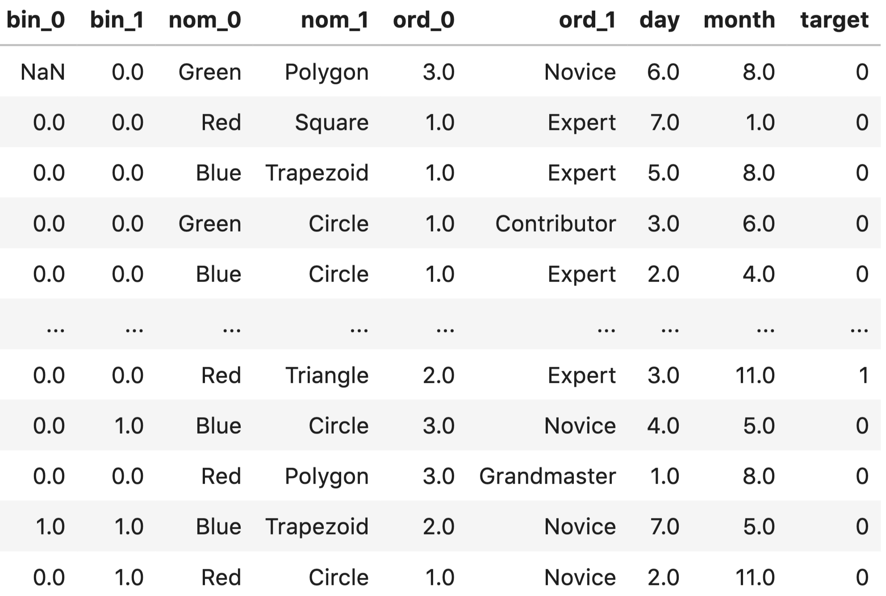
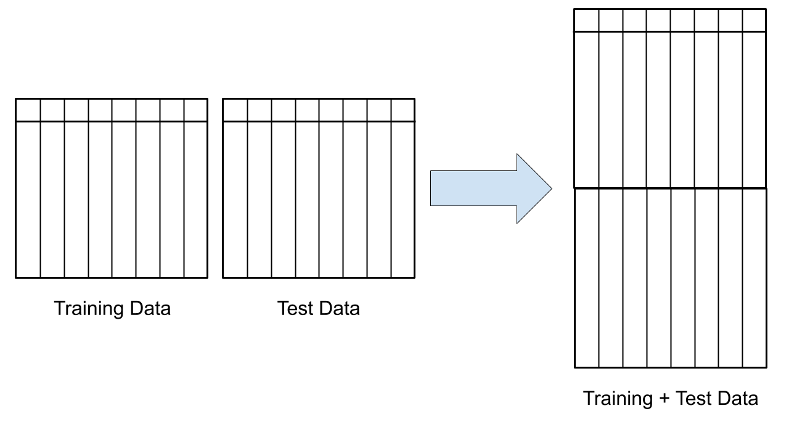
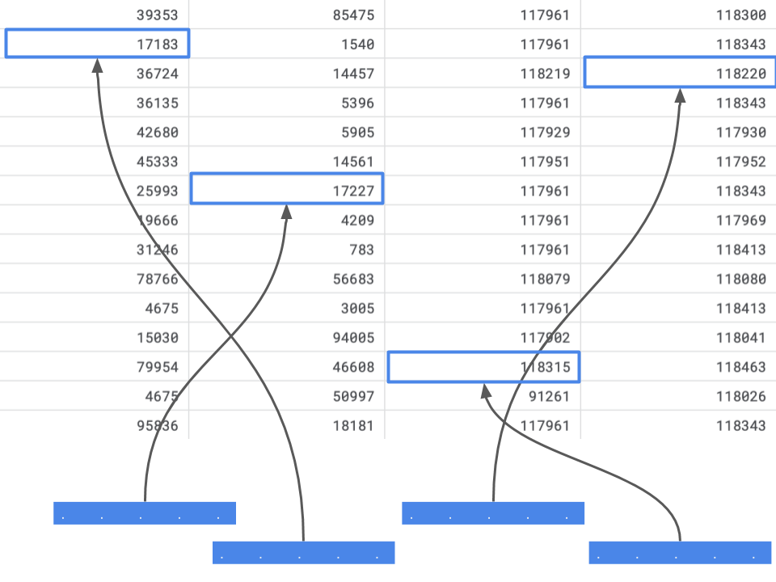

# 处理分类变量

很多人在处理分类变量时都会遇到很多困难，因此这值得用整整一章的篇幅来讨论。在本章中，我将讲述不同类型的分类数据，以及如何处理分类变量问题。

**什么是分类变量？**

分类变量/特征是指任何特征类型，可分为两大类：
- 无序
- 有序

**无序变量**是指有两个或两个以上类别的变量，这些类别没有任何相关顺序。例如，如果将性别分为两组，即男性和女性，则可将其视为名义变量。

**有序变量**则有 "等级 "或类别，并有特定的顺序。例如，一个顺序分类变量可以是一个具有低、中、高三个不同等级的特征。顺序很重要。

就定义而言，我们也可以将分类变量分为**二元变量**，即只有两个类别的分类变量。有些人甚至把分类变量称为 "**循环** "变量。周期变量以 "周期 "的形式存在，例如一周中的天数： 周日、周一、周二、周三、周四、周五和周六。周六过后，又是周日。这就是一个循环。另一个例子是一天中的小时数，如果我们将它们视为类别的话。

分类变量有很多不同的定义，很多人也谈到要根据分类变量的类型来处理不同的分类变量。不过，我认为没有必要这样做。所有涉及分类变量的问题都可以用同样的方法处理。

开始之前，我们需要一个数据集（一如既往）。要了解分类变量，最好的免费数据集之一是 Kaggle 分类特征编码挑战赛中的 *cat-in-the-dat*。共有两个挑战，我们将使用第二个挑战的数据，因为它比前一个版本有更多变量，难度也更大。

让我们来看看数据。



<p align="center"><b>图 1：Cat-in-the-dat-ii challenge部分数据展示</b> </p>

数据集由各种分类变量组成： 

- 无序
- 有序
- 循环
- 二元

在图 1 中，我们只看到所有存在的变量和目标变量的子集。

这是一个二元分类问题。

目标变量对于我们学习分类变量来说并不十分重要，但最终我们将建立一个端到端模型，因此让我们看看图 2 中的目标变量分布。我们看到目标是**偏斜**的，因此对于这个二元分类问题来说，最好的指标是 ROC 曲线下面积（AUC）。我们也可以使用精确度和召回率，但 AUC 结合了这两个指标。因此，我们将使用 AUC 来评估我们在该数据集上建立的模型。


<p align="center"><b>图 2：标签计数。X 轴表示标签，Y 轴表示标签计数</b> </p>

总体而言，有：

- 5个二元变量
- 10个无序变量
- 6个有序变量
- 2个循环变量
- 1个目标变量

让我们来看看数据集中的 **ord_2** 特征。它包括6个不同的类别：
- 冰冻
- 温暖
- 寒冷
- 较热
- 热
- 非常热

我们必须知道，计算机无法理解文本数据，因此我们需要将这些类别转换为数字。一个简单的方法是创建一个字典，将这些值映射为从 0 到 N-1 的数字，其中 N 是给定特征中类别的总数。

```python
# 映射字典
mapping = {
"Freezing": 0, 
"Warm": 1, 
"Cold": 2,
"Boiling Hot": 3, 
"Hot": 4,
"Lava Hot": 5 
}
```

现在，我们可以读取数据集，并轻松地将这些类别转换为数字。

```python
import pandas as pd
# 读取数据
df = pd.read_csv("../input/cat_train.csv") 
# 取*ord_2*列，并使用映射将类别转换为数字
df.loc[:, "*ord_2*"] = df.*ord_2*.map(mapping)
```

映射前的数值计数：

```python
df.*ord_2*.value_counts()
Freezing 142726 
Warm 124239
Cold           97822
Boiling Hot    84790
Hot            67508
Lava Hot       64840 
Name: *ord_2*, dtype: int64
```

映射后的数值计数：

```python
0.0   142726
1.0   124239
2.0    97822
3.0    84790
4.0    67508
5.0    64840
Name: *ord_2*, dtype: int64
```

这种分类变量的编码方式被称为标签编码（Label Encoding）我们将每个类别编码为一个数字标签。

我们也可以使用 scikit-learn 中的 LabelEncoder 进行编码。

```python
import pandas as pd
from sklearn import preprocessing 
# 读取数据
df = pd.read_csv("../input/cat_train.csv") 
# 将缺失值填充为"NONE"
df.loc[:, "*ord_2*"] = df.*ord_2*.fillna("NONE") 
# LabelEncoder编码
lbl_enc = preprocessing.LabelEncoder()
# 转换数据
df.loc[:, "*ord_2*"] = lbl_enc.fit_transform(df.*ord_2*.values)
```

你会看到我使用了 pandas 的 fillna。原因是 scikit-learn 的 LabelEncoder 无法处理 NaN 值，而 *ord_2* 列中有 NaN 值。

我们可以在许多基于树的模型中直接使用它：
- 决策树
- 随机森林
- 提升树
- 或任何一种提升树模型 
- XGBoost
- GBM 
- LightGBM

这种编码方式不能用于线性模型、支持向量机或神经网络，因为它们希望数据是标准化的。

对于这些类型的模型，我们可以对数据进行二值化（binarize）处理。

```python
Freezing    --> 0 --> 0 0 0
Warm        --> 1 --> 0 0 1 
Cold        --> 2 --> 0 1 0 
Boiling Hot --> 3 --> 0 1 1 
Hot         --> 4 --> 1 0 0 
Lava Hot    --> 5 --> 1 0 1
```

这只是将类别转换为数字，然后再转换为二值化表示。这样，我们就把一个特征分成了三个（在本例中）特征（或列）。如果我们有更多的类别，最终可能会分成更多的列。

如果我们用稀疏格式存储大量二值化变量，就可以轻松地存储这些变量。稀疏格式不过是一种在内存中存储数据的表示或方式，在这种格式中，你并不存储所有的值，而只存储重要的值。在上述二进制变量的情况中，最重要的就是有 1 的地方。

很难想象这样的格式，但举个例子就会明白。

假设上面的数据帧中只有一个特征：*ord_2*。

| Index | Feature  |
| :---: | :------: |
|   0   |   Warm   |
|   1   |   Hot    |
|   2   | Lava hot |

目前，我们只看到数据集中的三个样本。让我们将其转换为二值表示法，即每个样本有三个项目。

这三个项目就是三个特征。

| Index | Feature_0 | Feature_1 | Feature_2 |
| :---: | :-------: | :-------: | :-------: |
|   0   |     0     |     0     |     1     |
|   1   |     1     |     0     |     0     |
|   2   |     1     |     0     |     1     |

因此，我们的特征存储在一个有 3 行 3 列（3x3）的矩阵中。矩阵的每个元素占用 8 个字节。因此，这个数组的总内存需求为 8x3x3 = 72 字节。

我们还可以使用一个简单的 python 代码段来检查这一点。

```python
import numpy as np

example = np.array( 
    [
        [0, 0, 1], 
        [1, 0, 0], 
        [1, 0, 1]
    ] 
)

print(example.nbytes)
```

这段代码将打印出 72，就像我们之前计算的那样。但我们需要存储这个矩阵的所有元素吗？如前所述，我们只对 1 感兴趣。0 并不重要，因为任何与 0 相乘的元素都是 0，而 0 与任何元素相加或相减也没有任何区别。只用 1 表示矩阵的一种方法是某种字典方法，其中键是行和列的索引，值是 1：

```python
(0, 2)      1
(1, 0)      1
(2, 0)      1
(2, 2)      1
```

这样的符号占用的内存要少得多，因为它只需存储四个值（在本例中）。使用的总内存为 8x4 = 32 字节。任何 numpy 数组都可以通过简单的 python 代码转换为稀疏矩阵。

```python
import numpy as np
from scipy import sparse

example = np.array(
    [
        [0, 0, 1], 
        [1, 0, 0], 
        [1, 0, 1]
    ] 
)
sparse_example = sparse.csr_matrix(example)

print(sparse_example.data.nbytes)
```

这将打印 32，比我们的密集数组少了这么多！稀疏 csr 矩阵的总大小是三个值的总和。

```python
print(
    sparse_example.data.nbytes +
    sparse_example.indptr.nbytes +
    sparse_example.indices.nbytes 
)
```

这将打印出 64 个元素，仍然少于我们的密集数组。遗憾的是，我不会详细介绍这些元素。你可以在 scipy 文档中了解更多。当我们拥有更大的数组时，比如说拥有数千个样本和数万个特征的数组，大小差异就会变得非常大。例如，我们使用基于计数特征的文本数据集。

```python
import numpy as np
from scipy import sparse
n_rows = 10000
n_cols = 100000

# 生成符合伯努利分布的随机数组，维度为[10000, 100000]
example = np.random.binomial(1, p=0.05, size=(n_rows, n_cols))
print(f"Size of dense array: {example.nbytes}") 
# 将随机矩阵转换为洗漱矩阵
sparse_example = sparse.csr_matrix(example)
print(f"Size of sparse array: {sparse_example.data.nbytes}") 
full_size = (
    sparse_example.data.nbytes +
    sparse_example.indptr.nbytes +
    sparse_example.indices.nbytes 
)

print(f"Full size of sparse array: {full_size}")
```

这将打印：

```python
Size of dense array: 8000000000 
Size of sparse array: 399932496
Full size of sparse array: 599938748
```

因此，密集阵列需要 ~8000MB 或大约 8GB 内存。而稀疏阵列只占用 399MB 内存。

这就是为什么当我们的特征中有大量零时，我们更喜欢稀疏阵列而不是密集阵列的原因。

请注意，稀疏矩阵有多种不同的表示方法。这里我只展示了其中一种（可能也是最常用的）方法。深入探讨这些方法超出了本书的范围，因此留给读者一个练习。

尽管二值化特征的稀疏表示比其密集表示所占用的内存要少得多，但对于分类变量来说，还有一种转换所占用的内存更少。这就是所谓的 "**独热编码**"。

独热编码也是一种二值编码，因为只有 0 和 1 两个值。但必须注意的是，它并不是二值表示法。我们可以通过下面的例子来理解它的表示法。

假设我们用一个向量来表示 *ord_2* 变量的每个类别。这个向量的大小与 *ord_2* 变量的类别数相同。在这种特定情况下，每个向量的大小都是 6，并且除了一个位置外，其他位置都是 0。让我们来看看这个特殊的向量表。

|  Freezing   |  0   |  0   |  0   |  0   |  0   |  1   |
| :---------: | :--: | :--: | :--: | :--: | :--: | :--: |
|    Warm     |  0   |  0   |  0   |  0   |  1   |  0   |
|    Cold     |  0   |  0   |  0   |  1   |  0   |  0   |
| Boiling Hot |  0   |  0   |  1   |  0   |  0   |  0   |
|     Hot     |  0   |  1   |  0   |  0   |  0   |  0   |
|  Lava Hot   |  1   |  0   |  0   |  0   |  0   |  0   |

我们看到向量的大小是 1x6，即向量中有6个元素。这个数字是怎么来的呢？如果你仔细观察，就会发现如前所述，有6个类别。在进行独热编码时，向量的大小必须与我们要查看的类别数相同。每个向量都有一个 1，其余所有值都是 0。现在，让我们用这些特征来代替之前的二值化特征，看看能节省多少内存。

如果你还记得以前的数据，它看起来如下：

| Index | Feature  |
| :---: | :------: |
|   0   |   Warm   |
|   1   |   Hot    |
|   2   | Lava hot |

每个样本有3个特征。但在这种情况下，独热向量的大小为 6。因此，我们有6个特征，而不是3个。

| Index | F_0  | F_1  | F_2  | F_3  | F_4  | F_5  |
| :---: | :--: | :--: | :--: | :--: | :--: | :--: |
|   0   |  0   |  0   |  0   |  0   |  1   |  0   |
|   1   |  0   |  1   |  0   |  0   |  0   |  0   |
|   2   |  1   |  0   |  1   |  0   |  0   |  0   |

因此，我们有 6 个特征，而在这个 3x6 数组中，只有 3 个1。使用 numpy 计算大小与二值化大小计算脚本非常相似。你需要改变的只是数组。让我们看看这段代码。

```python
import numpy as np
from scipy import sparse 
example = np.array( 
    [
        [0, 0, 0, 0, 1, 0], 
        [0, 1, 0, 0, 0, 0], 
        [1, 0, 0, 0, 0, 0]
    ] 
)

print(f"Size of dense array: {example.nbytes}") 
sparse_example = sparse.csr_matrix(example)
print(f"Size of sparse array: {sparse_example.data.nbytes}") 
full_size = (
    sparse_example.data.nbytes +
    sparse_example.indptr.nbytes +
    sparse_example.indices.nbytes 
)
print(f"Full size of sparse array: {full_size}")
```

打印内存大小为：

```python
Size of dense array: 144
Size of sparse array: 24 
Full size of sparse array: 52
```

我们可以看到，密集矩阵的大小远远大于二值化矩阵的大小。不过，稀疏数组的大小要更小。让我们用更大的数组来试试。在本例中，我们将使用 scikit-learn 中的 OneHotEncoder 将包含 1001 个类别的特征数组转换为密集矩阵和稀疏矩阵。

```python
import numpy as np
from sklearn import preprocessing

# 生成符合均匀分布的随机整数，维度为[1000000, 10000000]
example = np.random.randint(1000, size=1000000)
# 独热编码，非稀疏矩阵
ohe = preprocessing.OneHotEncoder(sparse=False)
# 将随机数组展平
ohe_example = ohe.fit_transform(example.reshape(-1, 1))
print(f"Size of dense array: {ohe_example.nbytes}") 
# 独热编码，稀疏矩阵
ohe = preprocessing.OneHotEncoder(sparse=True)
# 将随机数组展平
ohe_example = ohe.fit_transform(example.reshape(-1, 1))
print(f"Size of sparse array: {ohe_example.data.nbytes}") 
full_size = (
    ohe_example.data.nbytes +
    ohe_example.indptr.nbytes + 
    ohe_example.indices.nbytes 
)
print(f"Full size of sparse array: {full_size}")
```

上面代码打印的输出：

```python
Size of dense array: 8000000000 
Size of sparse array: 8000000 
Full size of sparse array: 16000004
```

这里的密集阵列大小约为 8GB，稀疏阵列为 8MB。如果可以选择，你会选择哪个？在我看来，选择很简单，不是吗？

这三种方法（标签编码、稀疏矩阵、独热编码）是处理分类变量的最重要方法。不过，你还可以用很多其他不同的方法来处理分类变量。将分类变量转换为数值变量就是其中的一个例子。

假设我们回到之前的分类特征数据（原始数据中的 cat-in-the-dat-ii）。在数据中，*ord_2* 的值为“热“的 id 有多少？

我们可以通过计算数据的形状（shape）轻松计算出这个值，其中 *ord_2* 列的值为 *Boiling Hot*。

```python
In [X]: df[df.ord_2 == "Boiling Hot"].shape
Out[X]: (84790, 25)
```

我们可以看到，有 84790 条记录具有此值。我们还可以使用 pandas 中的 *groupby* 计算所有类别的该值。

```python
In [X]: df.groupby(["ord_2"])["id"].count()
Out[X]: 
ord_2
Boiling Hot    84790
Cold 97822 
Freezing 142726 
Hot 67508 
Lava Hot 64840 
Warm 124239 
Name: id, dtype: int64
```

如果我们只是将 *ord_2* 列替换为其计数值，那么我们就将其转换为一种数值特征了。我们可以使用 pandas 的*transform*函数和 *groupby* 来创建新列或替换这一列。

```python
In [X]: df.groupby(["ord_2"])["id"].transform("count")
Out[X]:
0         67508.0
1        124239.0
2        142726.0
3         64840.0
4         97822.0
...
599995   142726.0
599996    84790.0
599997   142726.0
599998   124239.0
599999    84790.0
Name: id, Length: 600000, dtype: float64
```

你可以添加所有特征的计数，也可以替换它们，或者根据多个列及其计数进行分组。例如，以下代码通过对 *ord_1* 和 *ord_2* 列分组进行计数。

```python
In [X]: df.groupby(
   ...:     [
   ...:        "ord_1",
   ...:        "ord_2"
   ...:     ]
   ...: )["id"].count().reset_index(name="count") 
Out[X]:
ord_1        ord_2  count
0  Contributor  Boiling Hot 15634
1  Contributor         Cold 17734
2  Contributor     Freezing 26082
3  Contributor          Hot 12428
4  Contributor     Lava Hot 11919
5  Contributor         Warm 22774
6       Expert  Boiling Hot 19477
7       Expert         Cold 22956
8       Expert     Freezing 33249
9       Expert          Hot 15792
10      Expert     Lava Hot 15078
11      Expert         Warm 28900
12 Grandmaster  Boiling Hot 13623
13 Grandmaster         Cold 15464
14 Grandmaster     Freezing 22818
15 Grandmaster          Hot 10805
16 Grandmaster     Lava Hot 10363
17 Grandmaster         Warm 19899
18      Master  Boiling Hot 10800
...
```

请注意，我已经从输出中删除了一些行，以便在一页中容纳这些行。这是另一种可以作为功能添加的计数。您现在一定已经注意到，我使用 id 列进行计数。不过，你也可以通过对列的组合进行分组，对其他列进行计数。

还有一个小窍门，就是从这些分类变量中创建新特征。你可以从现有的特征中创建新的分类特征，而且可以毫不费力地做到这一点。

```python
In [X]: df["new_feature"] = (
   ...:     df.ord_1.astype(str)
   ...:     + "_"
   ...:     + df.ord_2.astype(str)
   ...: )
In [X]: df.new_feature 
Out[X]:
0                Contributor_Hot
1               Grandmaster_Warm
2                   nan_Freezing
3                Novice_Lava Hot
4               Grandmaster_Cold
               ...
599999   Contributor_Boiling Hot
Name: new_feature, Length: 600000, dtype: object
```

在这里，我们用下划线将 *ord_1* 和 *ord_2* 合并，然后将这些列转换为字符串类型。请注意，NaN 也会转换为字符串。不过没关系。我们也可以将 NaN 视为一个新的类别。这样，我们就有了一个由这两个特征组合而成的新特征。您还可以将三列以上或四列甚至更多列组合在一起。

```python
In [X]: df["new_feature"] = (
   ...:     df.ord_1.astype(str)
   ...:     + "_"
   ...:     + df.ord_2.astype(str)
   ...:     + "_"
   ...:     + df.ord_3.astype(str)
   ...: )
In [X]: df.new_feature 
Out[X]:
0                Contributor_Hot_c
1               Grandmaster_Warm_e
2                   nan_Freezing_n
3                Novice_Lava Hot_a
4               Grandmaster_Cold_h
               ...
599999   Contributor_Boiling Hot_b
Name: new_feature, Length: 600000, dtype: object
```

那么，我们应该把哪些类别结合起来呢？这并没有一个简单的答案。这取决于您的数据和特征类型。一些领域知识对于创建这样的特征可能很有用。但是，如果你不担心内存和 CPU 的使用，你可以采用一种贪婪的方法，即创建许多这样的组合，然后使用一个模型来决定哪些特征是有用的，并保留它们。我们将在本书稍后部分介绍这种方法。

无论何时获得分类变量，都要遵循以下简单步骤：
- 填充 NaN 值（这一点非常重要！）。
- 使用 scikit-learn 的 LabelEncoder 或映射字典进行标签编码，将它们转换为整数。如果没有填充 NaN 值，可能需要在这一步中进行处理
- 创建独热编码。是的，你可以跳过二值化！
- 建模！我指的是机器学习。

在分类特征中处理 NaN 数据非常重要，否则您可能会从 scikit-learn 的 LabelEncoder 中得到臭名昭著的错误信息：

```python
ValueError: y contains previously unseen labels: [nan, nan, nan, nan, nan, nan, nan, nan]
```

这仅仅意味着，在转换测试数据时，数据中出现了 NaN 值。这是因为你在训练时忘记了处理它们。**处理 NaN 值**的一个简单方法就是丢弃它们。虽然简单，但并不理想。NaN 值中可能包含很多信息，如果只是丢弃这些值，就会丢失这些信息。在很多情况下，大部分数据都是 NaN 值，因此不能丢弃 NaN 值的行/样本。处理 NaN 值的另一种方法是将其作为一个全新的类别。这是处理 NaN 值最常用的方法。如果使用 pandas，还可以通过非常简单的方式实现。

请看我们之前查看过的数据的 *ord_2* 列。

```python
In [X]: df.ord_2.value_counts() 
Out[X]:
Freezing 142726 
Warm 124239
Cold           97822
Boiling Hot    84790
Hot            67508 
Lava Hot       64840 
Name: ord_2, dtype: int64
```

填入 NaN 值后，就变成了

```python
In [X]: df.ord_2.fillna("NONE").value_counts()
Out[X]:
Freezing 142726 
Warm 124239
Cold           97822
Boiling Hot    84790
Hot            67508
Lava Hot       64840 
NONE           18075 
Name: ord_2, dtype: int64
```

哇！这一列中有 18075 个 NaN 值，而我们之前甚至都没有考虑使用它们。增加了这个新类别后，类别总数从 6 个增加到了 7 个。这没关系，因为现在我们在建立模型时，也会考虑 NaN。相关信息越多，模型就越好。

假设 *ord_2* 没有任何 NaN 值。我们可以看到，这一列中的所有类别都有显著的计数。其中没有 "罕见 "类别，即只在样本总数中占很小比例的类别。现在，让我们假设您在生产中部署了使用这一列的模型，当模型或项目上线时，您在 *ord_2* 列中得到了一个在训练中不存在的类别。在这种情况下，模型管道会抛出一个错误，您对此无能为力。如果出现这种情况，那么可能是生产中的管道出了问题。如果这是预料之中的，那么您就必须修改您的模型管道，并在这六个类别中加入一个新类别。

这个新类别被称为 "罕见 "类别。罕见类别是一种不常见的类别，可以包括许多不同的类别。您也可以尝试使用近邻模型来 "预测 "未知类别。请记住，如果您预测了这个类别，它就会成为训练数据中的一个类别。


<p align="center"><b>图 3：具有不同特征且无标签的数据集示意图，其中一个特征可能会在测试集或实时数据中出现新值</b> </p>

当我们有一个如图 3 所示的数据集时，我们可以建立一个简单的模型，对除 "f3 "之外的所有特征进行训练。这样，你将创建一个模型，在不知道或训练中没有 "f3 "时预测它。我不敢说这样的模型是否能带来出色的性能，但也许能处理测试集或实时数据中的缺失值，就像机器学习中的其他事情一样，不尝试一下是说不准的。

如果你有一个固定的测试集，你可以将测试数据添加到训练中，以了解给定特征中的类别。这与半监督学习非常相似，即使用无法用于训练的数据来改进模型。这也会照顾到在训练数据中出现次数极少但在测试数据中大量存在的稀有值。你的模型将更加稳健。

很多人认为这种想法会过度拟合。可能过拟合，也可能不过拟合。有一个简单的解决方法。如果你在设计交叉验证时，能够在测试数据上运行模型时复制预测过程，那么它就永远不会过拟合。这意味着第一步应该是分离折叠，在每个折叠中，你应该应用与测试数据相同的预处理。假设您想合并训练数据和测试数据，那么在每个折叠中，您必须合并训练数据和验证数据，并确保验证数据集复制了测试集。在这种特定情况下，您必须以这样一种方式设计验证集，使其包含训练集中 "未见 "的类别。



<p align="center"><b>图 4：对训练集和测试集进行简单合并，以了解测试集中存在但训练集中不存在的类别或训练集中罕见的类别</b> </p>

只要看一下图 4 和下面的代码，就能很容易理解其工作原理。

```python
import pandas as pd
from sklearn import preprocessing 
# 读取训练集
train = pd.read_csv("../input/cat_train.csv") 
# 读取测试集
test = pd.read_csv("../input/cat_test.csv") 
# 将测试集"target"列全部置为-1
test.loc[:, "target"] = -1
# 将训练集、测试集沿行拼接
data = pd.concat([train, test]).reset_index(drop=True) 
# 将除"id"和"target"列的其他特征列名取出
features = [x for x in train.columns if x not in ["id", "target"]] 
# 遍历特征
for feat in features:
    # 标签编码
    lbl_enc = preprocessing.LabelEncoder()
    # 将空值替换为"NONE",并将该列格式变为str
    temp_col = data[feat].fillna("NONE").astype(str).values 
    # 转换数值
    data.loc[:, feat] = lbl_enc.fit_transform(temp_col)

# 根据"target"列将训练集与测试集分开
train = data[data.target != -1].reset_index(drop=True) 
test = data[data.target == -1].reset_index(drop=True)
```

当您遇到已经有测试数据集的问题时，这个技巧就会起作用。必须注意的是，这一招在实时环境中不起作用。例如，假设您所在的公司提供实时竞价解决方案（RTB）。RTB 系统会对在线看到的每个用户进行竞价，以购买广告空间。这种模式可使用的功能可能包括网站中浏览的页面。我们假设这些特征是用户访问的最后五个类别/页面。在这种情况下，如果网站引入了新的类别，我们将无法再准确预测。在这种情况下，我们的模型就会失效。这种情况可以通过使用 **"未知 "类别来避免**。

在我们的 cat-in-the-dat 数据集中，*ord_2* 列中已经有了未知类别。

```python
In [X]: df.ord_2.fillna("NONE").value_counts()
Out[X]:
Freezing       142726 
Warm           124239
Cold           97822 
Boiling Hot    84790 
Hot            67508 
Lava Hot       64840 
NONE           18075 
Name: ord_2, dtype: int64
```

我们可以将 "NONE "视为未知。因此，如果在实时测试过程中，我们获得了以前从未见过的新类别，我们就会将其标记为 "NONE"。

这与自然语言处理问题非常相似。我们总是基于固定的词汇建立模型。增加词汇量就会增加模型的大小。像 BERT 这样的转换器模型是在 ~30000 个单词（英语）的基础上训练的。因此，当有新词输入时，我们会将其标记为 UNK（未知）。

因此，您可以假设测试数据与训练数据具有相同的类别，也可以在训练数据中引入罕见或未知类别，以处理测试数据中的新类别。

让我们看看填入 NaN 值后 ord_4 列的值计数：

```python
In [X]: df.ord_4.fillna("NONE").value_counts()
Out[X]:
N       39978 
P       37890
Y       36657 
A       36633
R       33045
U       32897
. 
. 
.
K       21676
I       19805 
NONE    17930 
D       17284
F       16721 
W       8268
Z       5790
S       4595
G       3404
V       3107
J       1950
L       1657
Name: ord_4, dtype: int64
```

我们看到，有些数值只出现了几千次，有些则出现了近 40000 次。NaN 也经常出现。请注意，我已经从输出中删除了一些值。

现在，我们可以定义将一个值称为 "**罕见（rare）** "的标准了。比方说，在这一列中，稀有值的要求是计数小于 2000。这样看来，J 和 L 就可以被标记为稀有值了。使用 pandas，根据计数阈值替换类别非常简单。让我们来看看它是如何实现的。

```python
In [X]: df.ord_4 = df.ord_4.fillna("NONE")
In [X]: df.loc[
   ...:     df["ord_4"].value_counts()[df["ord_4"]].values < 2000,
   ...:    "ord_4"
   ...: ] = "RARE"
In [X]: df.ord_4.value_counts()
Out[X]:
N      39978
P      37890
Y      36657
A      36633
R      33045 
U      32897
M      32504
. 
. 
.
B      25212
E      21871 
K      21676
I      19805 
NONE   17930
D      17284
F      16721 
W       8268
Z       5790
S       4595 
RARE    3607
G       3404
V       3107
Name: ord_4, dtype: int64
```

我们认为，只要某个类别的值小于 2000，就将其替换为罕见。因此，现在在测试数据时，所有未见过的新类别都将被映射为 "RARE"，而所有缺失值都将被映射为 "NONE"。

这种方法还能确保即使有新的类别，模型也能在实际环境中正常工作。

现在，我们已经具备了处理任何带有分类变量问题所需的一切条件。让我们尝试建立第一个模型，并逐步提高其性能。

在构建任何类型的模型之前，交叉检验至关重要。我们已经看到了标签/目标分布，知道这是一个目标偏斜的二元分类问题。因此，我们将使用 StratifiedKFold 来分割数据。

```python
import pandas as pd
from sklearn import model_selection 
if __name__ == "__main__":
    # 读取数据文件
	df = pd.read_csv("../input/cat_train.csv")
    # 添加"kfold"列，并置为-1
	df["kfold"] = -1
    # 打乱数据顺序，重置索引
	df = df.sample(frac=1).reset_index(drop=True)
    # 将目标列取出
	y = df.target.values
    # 分层k折交叉检验
	kf = model_selection.StratifiedKFold(n_splits=5)
	for f, (t_, v_) in enumerate(kf.split(X=df, y=y)): 
        # 区分折叠
		df.loc[v_, 'kfold'] = f
    # 保存文件
	df.to_csv("../input/cat_train_folds.csv", index=False)
```

现在我们可以检查新的折叠 csv，查看每个折叠的样本数：

```python
In [X]: import pandas as pd
In [X]: df = pd.read_csv("../input/cat_train_folds.csv") 
In [X]: df.kfold.value_counts()
Out[X]: 
4   120000 
3   120000 
2   120000 
1   120000 
0   120000
Name: kfold, dtype: int64
```

所有折叠都有 120000 个样本。这是意料之中的，因为训练数据有 600000 个样本，而我们做了5次折叠。到目前为止，一切顺利。

现在，我们还可以检查每个折叠的目标分布。

```python
In [X]: df[df.kfold==0].target.value_counts()
Out[X]:
0   97536
1   22464
Name: target, dtype: int64
In [X]: df[df.kfold==1].target.value_counts() 
Out[X]:
0   97536
1   22464
Name: target, dtype: int64
In [X]: df[df.kfold==2].target.value_counts() 
Out[X]:
0   97535
1   22465
Name: target, dtype: int64
In [X]: df[df.kfold==3].target.value_counts() 
Out[X]:
0   97535
1   22465
Name: target, dtype: int64
In [X]: df[df.kfold==4].target.value_counts() 
Out[X]:
0   97535
1   22465
Name: target, dtype: int64
```

我们看到，在每个折叠中，目标的分布都是一样的。这正是我们所需要的。它也可以是相似的，并不一定要一直相同。现在，当我们建立模型时，每个折叠中的标签分布都将相同。

我们可以建立的最简单的模型之一是对所有数据进行独热编码并使用逻辑回归。

```python
import pandas as pd
from sklearn import linear_model
from sklearn import metrics
from sklearn import preprocessing
def run(fold):
    # 读取分层k折交叉检验数据
    df = pd.read_csv("../input/cat_train_folds.csv")
    # 取除"id", "target", "kfold"外的其他特征列
    features = [
        f for f in df.columns if f not in ("id", "target", "kfold") 
    ]
    # 遍历特征列表
    for col in features:
        # 将空值置为"NONE"
        df.loc[:, col] = df[col].astype(str).fillna("NONE")
    # 取训练集（kfold列中不为fold的样本，重置索引）
    df_train = df[df.kfold != fold].reset_index(drop=True) 
    # 取验证集（kfold列中为fold的样本，重置索引）
    df_valid = df[df.kfold == fold].reset_index(drop=True) 
    # 独热编码
    ohe = preprocessing.OneHotEncoder()
    # 将训练集、验证集沿行合并
    full_data = pd.concat([df_train[features], df_valid[features]], axis=0)
    ohe.fit(full_data[features])
    # 转换训练集
    x_train = ohe.transform(df_train[features])
    # 转换测试集
    x_valid = ohe.transform(df_valid[features])
    # 逻辑回归
    model = linear_model.LogisticRegression()
    # 使用训练集训练模型
    model.fit(x_train, df_train.target.values)
    # 使用验证集得到预测标签
    valid_preds = model.predict_proba(x_valid)[:, 1] 
    # 计算auc指标
    auc = metrics.roc_auc_score(df_valid.target.values, valid_preds)
    print(auc)
if __name__ == "__main__":
    # 运行折叠0
    run(0)
```

那么，发生了什么呢？

我们创建了一个函数，将数据分为训练和验证两部分，给定折叠数，处理 NaN 值，对所有数据进行单次编码，并训练一个简单的逻辑回归模型。

当我们运行这部分代码时，会产生如下输出：

```python
❯ python ohe_logres.py
/home/abhishek/miniconda3/envs/ml/lib/python3.7/site-
packages/sklearn/linear_model/_logistic.py:939: ConvergenceWarning: lbfgs 
failed to converge (status=1):
STOP: TOTAL NO. of ITERATIONS REACHED LIMIT.
Increase the number of iterations (max_iter) or scale the data as shown 
in:
	https://scikit-learn.org/stable/modules/preprocessing.html.
Please also refer to the documentation for alternative solver options: 
	https://scikit-learn.org/stable/modules/linear_model.html#logistic-
regression
extra_warning_msg=_LOGISTIC_SOLVER_CONVERGENCE_MSG)
0.7847865042255127
```

有一些警告。逻辑回归似乎没有收敛到最大迭代次数。我们没有调整参数，所以没有问题。我们看到 AUC 为 0.785。

现在让我们对代码进行简单修改，运行所有折叠。

```python
....

	model = linear_model.LogisticRegression()
	model.fit(x_train, df_train.target.values)
	valid_preds = model.predict_proba(x_valid)[:, 1] 
	auc = metrics.roc_auc_score(df_valid.target.values, valid_preds)
	print(f"Fold = {fold}, AUC = {auc}") 
if __name__ == "__main__":
    # 循环运行0~4折
	for fold_ in range(5): 
		run(fold_)
```

请注意，我们并没有做很大的改动，所以我只显示了部分代码行，其中一些代码行有改动。

这就打印出了：

```python
python -W ignore ohe_logres.py
Fold = 0, AUC = 0.7847865042255127
Fold = 1, AUC = 0.7853553605899214
Fold = 2, AUC = 0.7879321942914885
Fold = 3, AUC = 0.7870315929550808 
Fold = 4, AUC = 0.7864668243125608
```

请注意，我使用"-W ignore "忽略了所有警告。

我们看到，AUC 分数在所有褶皱中都相当稳定。平均 AUC 为 0.78631449527。对于我们的第一个模型来说相当不错！

很多人在遇到这种问题时会首先使用基于树的模型，比如随机森林。在这个数据集中应用随机森林时，我们可以使用标签编码（label encoding），将每一列中的每个特征都转换为整数，而不是之前讨论过的独热编码。

这种编码与独热编码并无太大区别。让我们来看看。

```python
import pandas as pd
from sklearn import ensemble
from sklearn import metrics
from sklearn import preprocessing
def run(fold):
    df = pd.read_csv("../input/cat_train_folds.csv")
    features = [f for f in df.columns if f not in ("id", "target", "kfold") ]
    for col in features:
        df.loc[:, col] = df[col].astype(str).fillna("NONE") 
    for col in features:
        # 标签编码
        lbl = preprocessing.LabelEncoder()
    	lbl.fit(df[col])
		df.loc[:, col] = lbl.transform(df[col])
	df_train = df[df.kfold != fold].reset_index(drop=True) 
	df_valid = df[df.kfold == fold].reset_index(drop=True) 
	x_train = df_train[features].values
	x_valid = df_valid[features].values
    # 随机森林模型
	model = ensemble.RandomForestClassifier(n_jobs=-1) 
    model.fit(x_train, df_train.target.values)
	valid_preds = model.predict_proba(x_valid)[:, 1] 
    auc = metrics.roc_auc_score(df_valid.target.values, valid_preds)
    print(f"Fold = {fold}, AUC = {auc}") 
if __name__ == "__main__":
	for fold_ in range(5): 
		run(fold_)
```

我们使用 scikit-learn 中的随机森林，并取消了独热编码。我们使用标签编码代替独热编码。得分如下

```python
❯ python lbl_rf.py
Fold = 0, AUC = 0.7167390828113697
Fold = 1, AUC = 0.7165459672958506
Fold = 2, AUC = 0.7159709909587376
Fold = 3, AUC = 0.7161589664189556
Fold = 4, AUC = 0.7156020216155978
```

哇  巨大的差异！ 随机森林模型在没有任何超参数调整的情况下，表现要比简单的逻辑回归差很多。

这就是为什么我们总是应该先从简单模型开始的原因。随机森林模型的粉丝会从这里开始，而忽略逻辑回归模型，认为这是一个非常简单的模型，不能带来比随机森林更好的价值。这种人将会犯下大错。在我们实现随机森林的过程中，与逻辑回归相比，折叠需要更长的时间才能完成。因此，我们不仅损失了 AUC，还需要更长的时间来完成训练。请注意，使用随机森林进行推理也很耗时，而且占用的空间也更大。

如果我们愿意，也可以尝试在稀疏的独热编码数据上运行随机森林，但这会耗费大量时间。我们还可以尝试使用奇异值分解来减少稀疏的独热编码矩阵。这是自然语言处理中提取主题的常用方法。

```python
import pandas as pd
from scipy import sparse
from sklearn import decomposition
from sklearn import ensemble
from sklearn import metrics
from sklearn import preprocessing
def run(fold):
	df = pd.read_csv("../input/cat_train_folds.csv")
	features = [f for f in df.columns if f not in ("id", "target", "kfold")]
    for col in features:
		df.loc[:, col] = df[col].astype(str).fillna("NONE") 
	df_train = df[df.kfold != fold].reset_index(drop=True) 
	df_valid = df[df.kfold == fold].reset_index(drop=True) 
    # 独热编码
	ohe = preprocessing.OneHotEncoder()
	full_data = pd.concat([df_train[features], df_valid[features]], axis=0)
	ohe.fit(full_data[features])

	x_train = ohe.transform(df_train[features])
	x_valid = ohe.transform(df_valid[features])
    # 奇异值分解
	svd = decomposition.TruncatedSVD(n_components=120) 
    full_sparse = sparse.vstack((x_train, x_valid)) 
    svd.fit(full_sparse)
    x_train = svd.transform(x_train)
    x_valid = svd.transform(x_valid)
	model = ensemble.RandomForestClassifier(n_jobs=-1)
    model.fit(x_train, df_train.target.values)
    valid_preds = model.predict_proba(x_valid)[:, 1] 
	auc = metrics.roc_auc_score(df_valid.target.values, valid_preds)
    print(f"Fold = {fold}, AUC = {auc}") 
if __name__ == "__main__":
	for fold_ in range(5): 
		run(fold_)
```

我们对全部数据进行独热编码，然后用训练数据和验证数据在稀疏矩阵上拟合 scikit-learn 的 TruncatedSVD。这样，我们将高维稀疏矩阵减少到 120 个特征，然后拟合随机森林分类器。

以下是该模型的输出结果：

```python
❯ python ohe_svd_rf.py
Fold = 0, AUC = 0.7064863038754249
Fold = 1, AUC = 0.706050102937374
Fold = 2, AUC = 0.7086069243167242
Fold = 3, AUC = 0.7066819080085971
Fold = 4, AUC = 0.7058154015055585
```

我们发现情况更糟。看来，解决这个问题的最佳方法是使用逻辑回归和独热编码。随机森林似乎耗时太多。也许我们可以试试 XGBoost。如果你不知道 XGBoost，它是最流行的梯度提升算法之一。由于它是一种基于树的算法，我们将使用标签编码数据。

```python
import pandas as pd
import xgboost as xgb
from sklearn import metrics 
from sklearn import preprocessing
def run(fold):
    df = pd.read_csv("../input/cat_train_folds.csv")
    features = [f for f in df.columns if f not in ("id", "target", "kfold") ]
    for col in features:
        df.loc[:, col] = df[col].astype(str).fillna("NONE") 
    for col in features:
        # 标签编码
        lbl = preprocessing.LabelEncoder()
        lbl.fit(df[col])
        df.loc[:, col] = lbl.transform(df[col])

	df_train = df[df.kfold != fold].reset_index(drop=True) 
	df_valid = df[df.kfold == fold].reset_index(drop=True) 
	x_train = df_train[features].values
	x_valid = df_valid[features].values
    # XGBoost模型
	model = xgb.XGBClassifier(
        n_jobs=-1, 
        max_depth=7, 
        n_estimators=200)
    model.fit(x_train, df_train.target.values)
    valid_preds = model.predict_proba(x_valid)[:, 1] 
    auc = metrics.roc_auc_score(df_valid.target.values, valid_preds)
    print(f"Fold = {fold}, AUC = {auc}") 
    if __name__ == "__main__":
        for fold_ in range(5): 
            run(fold_)
```

必须指出的是，在这段代码中，我对 xgboost 参数做了一些修改。xgboost 的默认最大深度（max_depth）是 3，我把它改成了 7，还把估计器数量（n_estimators）从 100 改成了 200。

该模型的 5 折交叉检验得分如下：

```python
❯ python lbl_xgb.py
Fold = 0, AUC = 0.7656768851999011
Fold = 1, AUC = 0.7633006564148015
Fold = 2, AUC = 0.7654277821434345
Fold = 3, AUC = 0.7663609758878182
Fold = 4, AUC = 0.764914671468069
```

我们可以看到，在不做任何调整的情况下，我们的得分比普通随机森林要高得多。

您还可以尝试一些特征工程，放弃某些对模型没有任何价值的列等。但似乎我们能做的不多，无法证明模型的改进。让我们把数据集换成另一个有大量分类变量的数据集。另一个有名的数据集是**美国成人人口普查数据（US adult census data）**。这个数据集包含一些特征，而你的任务是预测工资等级。让我们来看看这个数据集。图 5 显示了该数据集中的一些列。


<p align="center"><b>图 5：部分数据集展示</b> </p>

该数据集有以下几列：
- 年龄（age）

- 工作类别（workclass）
- 学历（fnlwgt）
- 教育程度（education）
- 教育程度（education.num）
- 婚姻状况（marital.status）
- 职业（occupation）
- 关系（relationship）
- 种族（race）
- 性别（sex）
- 资本收益（capital.gain）
- 资本损失（capital.loss）
- 每周小时数（hours.per.week）
- 原籍国（native.country）
- 收入（income）

这些特征大多不言自明。那些不明白的，我们可以不考虑。让我们先尝试建立一个模型。

我们看到收入列是一个字符串。让我们对这一列进行数值统计。

```python
In [X]: import pandas as pd
In [X]: df = pd.read_csv("../input/adult.csv") 
In [X]: df.income.value_counts()
Out[X]:
<=50K   24720
>50K     7841
```

我们可以看到，有 7841 个实例的收入超过 5 万美元。这占样本总数的 24%。因此，我们将保持与猫数据集相同的评估方法，即 AUC。 在开始建模之前，为了简单起见，我们将去掉几列特征，即

- 学历（fnlwgt）
- 年龄（age）
- 资本收益（capital.gain）
- 资本损失（capital.loss）
- 每周小时数（hours.per.week）

让我们试着用逻辑回归和独热编码器，看看会发生什么。第一步总是要进行交叉验证。我不会在这里展示这部分代码。留待读者练习。

```python
import pandas as pd
from sklearn import linear_model
from sklearn import metrics
from sklearn import preprocessing
def run(fold):
    df = pd.read_csv("../input/adult_folds.csv")
    # 需要删除的列
    num_cols = [ 
        "fnlwgt", 
        "age",
        "capital.gain", 
        "capital.loss", 
        "hours.per.week"
    ]
    df = df.drop(num_cols, axis=1) 
    # 映射
    target_mapping = { 
        "<=50K": 0, 
        ">50K": 1
    }
    # 使用映射替换
    df.loc[:, "income"] = df.income.map(target_mapping)
    # 取除"kfold", "income"列的其他列名
    features = [f for f in df.columns if f not in ("kfold", "income") ]
    for col in features:
        # 将空值替换为"NONE"
        df.loc[:, col] = df[col].astype(str).fillna("NONE") 
    # 取训练集（kfold列中不为fold的样本，重置索引）
	df_train = df[df.kfold != fold].reset_index(drop=True) 
    # 取验证集（kfold列中为fold的样本，重置索引）
	df_valid = df[df.kfold == fold].reset_index(drop=True) 
	# 独热编码
    ohe = preprocessing.OneHotEncoder()
    # 将训练集、测试集沿行合并
	full_data = pd.concat([df_train[features], df_valid[features]], axis=0)
	ohe.fit(full_data[features])
    # 转换训练集
	x_train = ohe.transform(df_train[features])
    # 转换验证集
	x_valid = ohe.transform(df_valid[features])
    # 构建逻辑回归模型
	model = linear_model.LogisticRegression()
    # 使用训练集训练模型
	model.fit(x_train, df_train.income.values)
    # 使用验证集得到预测标签
	valid_preds = model.predict_proba(x_valid)[:, 1] 
    # 计算auc指标
	auc = metrics.roc_auc_score(df_valid.income.values, valid_preds)
	print(f"Fold = {fold}, AUC = {auc}") 

if __name__ == "__main__":
    # 运行0~4折
    for fold_ in range(5): 
        run(fold_)
```

当我们运行这段代码时，我们会得到

```python
❯ python -W ignore ohe_logres.py
Fold = 0, AUC = 0.8794809708119079
Fold = 1, AUC = 0.8875785068274882
Fold = 2, AUC = 0.8852609687685753
Fold = 3, AUC = 0.8681236223251438
Fold = 4, AUC = 0.8728581541840037
```

对于一个如此简单的模型来说，这是一个非常不错的 AUC！
现在，让我们在不调整任何超参数的情况下尝试一下标签编码的xgboost。

```python
import pandas as pd
import xgboost as xgb
from sklearn import metrics 
from sklearn import preprocessing
def run(fold):
    df = pd.read_csv("../input/adult_folds.csv")
    num_cols = [ "fnlwgt", 
                "age",
                "capital.gain", 
                "capital.loss", 
                "hours.per.week"
               ]
    df = df.drop(num_cols, axis=1) 
    target_mapping = { 
        "<=50K": 0, 
        ">50K": 1
    }
	df.loc[:, "income"] = df.income.map(target_mapping)
	features = [f for f in df.columns if f not in ("kfold", "income") ]
	for col in features:
    	df.loc[:, col] = df[col].astype(str).fillna("NONE") 
	for col in features:
        # 标签编码
		lbl = preprocessing.LabelEncoder()
    	lbl.fit(df[col])
    	df.loc[:, col] = lbl.transform(df[col])

	df_train = df[df.kfold != fold].reset_index(drop=True) 
    df_valid = df[df.kfold == fold].reset_index(drop=True) 
	x_train = df_train[features].values
	x_valid = df_valid[features].values
    # XGBoost模型
	model = xgb.XGBClassifier(n_jobs=-1)
	model.fit(x_train, df_train.income.values)
    valid_preds = model.predict_proba(x_valid)[:, 1] 
    auc = metrics.roc_auc_score(df_valid.income.values, valid_preds)
    print(f"Fold = {fold}, AUC = {auc}") 

if __name__ == "__main__":
    # 运行0~4折
	for fold_ in range(5): 
		run(fold_)
```

让我们运行上面代码：

```python
❯ python lbl_xgb.py
Fold = 0, AUC = 0.8800810634234078
Fold = 1, AUC = 0.886811884948154
Fold = 2, AUC = 0.8854421433318472
Fold = 3, AUC = 0.8676319549361007
Fold = 4, AUC = 0.8714450054900602
```

这看起来已经相当不错了。让我们看看 *max_depth* 增加到 7 和 *n_estimators* 增加到 200 时的得分。

```python
❯ python lbl_xgb.py
Fold = 0, AUC = 0.8764108944332032
Fold = 1, AUC = 0.8840708537662638
Fold = 2, AUC = 0.8816601162613102
Fold = 3, AUC = 0.8662335762581732
Fold = 4, AUC = 0.8698983461709926
```

看起来并没有改善。

这表明，一个数据集的参数不能移植到另一个数据集。我们必须再次尝试调整参数，但我们将在接下来的章节中详细说明。

现在，让我们尝试在不调整参数的情况下将数值特征纳入 xgboost 模型。

```python
import pandas as pd
import xgboost as xgb
from sklearn import metrics 
from sklearn import preprocessing
def run(fold):
    df = pd.read_csv("../input/adult_folds.csv")
    # 加入数值特征
    num_cols = [ 
        "fnlwgt", 
        "age",
        "capital.gain", 
        "capital.loss", 
        "hours.per.week"
    ]
    target_mapping = { 
        "<=50K": 0, 
        ">50K": 1
    }
    df.loc[:, "income"] = df.income.map(target_mapping)
    features = [f for f in df.columns if f not in ("kfold", "income") ]
    for col in features: 
        if col not in num_cols:
            # 将空值置为"NONE"
            df.loc[:, col] = df[col].astype(str).fillna("NONE") 
            
    for col in features:
        if col not in num_cols:
            # 标签编码
            lbl = preprocessing.LabelEncoder()
            lbl.fit(df[col])
            df.loc[:, col] = lbl.transform(df[col])
    
	df_train = df[df.kfold != fold].reset_index(drop=True) 
	df_valid = df[df.kfold == fold].reset_index(drop=True) 
	x_train = df_train[features].values
	x_valid = df_valid[features].values
    # XGBoost模型
	model = xgb.XGBClassifier(n_jobs=-1)
    
    model.fit(x_train, df_train.income.values)
    valid_preds = model.predict_proba(x_valid)[:, 1] 
    auc = metrics.roc_auc_score(df_valid.income.values, valid_preds)
    print(f"Fold = {fold}, AUC = {auc}") 

if __name__ == "__main__":
    for fold_ in range(5): 
        run(fold_)
```

因此，我们保留数字列，只是不对其进行标签编码。这样，我们的最终特征矩阵就由数字列（原样）和编码分类列组成了。任何基于树的算法都能轻松处理这种混合。

请注意，在使用基于树的模型时，我们不需要对数据进行归一化处理。不过，这一点非常重要，在使用线性模型（如逻辑回归）时不容忽视。

现在让我们运行这个脚本！

```python
❯ python lbl_xgb_num.py
Fold = 0, AUC = 0.9209790185449889 
Fold = 1, AUC = 0.9247157449144706
Fold = 2, AUC = 0.9269329887598243
Fold = 3, AUC = 0.9119349082169275
Fold = 4, AUC = 0.9166408030141667
```

哇哦 

这是一个很好的分数！

现在，我们可以尝试添加一些功能。我们将提取所有分类列，并创建所有二度组合。请看下面代码段中的 feature_engineering 函数，了解如何实现这一点。

```python
import itertools
import pandas as pd
import xgboost as xgb
from sklearn import metrics
from sklearn import preprocessing 
def feature_engineering(df, cat_cols):
    # 生成两个特征的组合
    combi = list(itertools.combinations(cat_cols, 2)) 
    for c1, c2 in combi:
        df.loc[:, c1 + "_" + c2] = df[c1].astype(str) + "_" + df[c2].astype(str) 
    return df

def run(fold):
    df = pd.read_csv("../input/adult_folds.csv") 
    num_cols = [ "fnlwgt", 
                "age",
                "capital.gain", 
                "capital.loss", 
                "hours.per.week"
               ]
    target_mapping = { 
        "<=50K": 0, 
        ">50K": 1
    }
	df.loc[:, "income"] = df.income.map(target_mapping) 
	cat_cols = [c for c in df.columns if c not in num_cols and c not in ("kfold", "income")]
    # 特征工程
    df = feature_engineering(df, cat_cols)
    features = [f for f in df.columns if f not in ("kfold", "income")]
    for col in features:
        if col not in num_cols:
            df.loc[:, col] = df[col].astype(str).fillna("NONE") 

	for col in features:
        if col not in num_cols:
            lbl = preprocessing.LabelEncoder()
            lbl.fit(df[col])
            df.loc[:, col] = lbl.transform(df[col])

	df_train = df[df.kfold != fold].reset_index(drop=True) 
	df_valid = df[df.kfold == fold].reset_index(drop=True) 
	x_train = df_train[features].values
	x_valid = df_valid[features].values
	model = xgb.XGBClassifier(n_jobs=-1)
	model.fit(x_train, df_train.income.values)
    valid_preds = model.predict_proba(x_valid)[:, 1] 
    auc = metrics.roc_auc_score(df_valid.income.values, valid_preds)
    print(f"Fold = {fold}, AUC = {auc}") 

if __name__ == "__main__":
    for fold_ in range(5): 
        run(fold_)
```

这是从分类列中创建特征的一种非常幼稚的方法。我们应该仔细研究数据，看看哪些组合最合理。如果使用这种方法，最终可能会创建大量特征，在这种情况下，就需要使用某种特征选择来选出最佳特征。稍后我们将详细介绍特征选择。现在让我们来看看分数。

```python
❯ python lbl_xgb_num_feat.py
Fold = 0, AUC = 0.9211483465031423
Fold = 1, AUC = 0.9251499446866125
Fold = 2, AUC = 0.9262344766486692
Fold = 3, AUC = 0.9114264068794995
Fold = 4, AUC = 0.9177914453099201
```

看来，即使不改变任何超参数，只增加一些特征，我们也能提高一些折叠得分。让我们看看将 *max_depth* 增加到 7 是否有帮助。

```python
❯ python lbl_xgb_num_feat.py
Fold = 0, AUC = 0.9286668430204137
Fold = 1, AUC = 0.9329340656165378
Fold = 2, AUC = 0.9319817543218744
Fold = 3, AUC = 0.919046187194538
Fold = 4, AUC = 0.9245692057162671
```

我们再次改进了我们的模型。

请注意，我们还没有使用稀有值、二值化、独热编码和标签编码特征的组合以及其他几种方法。

从分类特征中进行特征工程的另一种方法是使用**目标编码**。但是，您必须非常小心，因为这可能会使您的模型过度拟合。目标编码是一种将给定特征中的每个类别映射到其平均目标值的技术，但必须始终以交叉验证的方式进行。这意味着首先要创建折叠，然后使用这些折叠为数据的不同列创建目标编码特征，方法与在折叠上拟合和预测模型的方法相同。因此，如果您创建了 5 个折叠，您就必须创建 5 次目标编码，这样最终，您就可以为每个折叠中的变量创建编码，而这些变量并非来自同一个折叠。然后在拟合模型时，必须再次使用相同的折叠。未见测试数据的目标编码可以来自全部训练数据，也可以是所有 5 个折叠的平均值。

让我们看看如何在同一个成人数据集上使用目标编码，以便进行比较。

```python
import copy
import pandas as pd
from sklearn import metrics 
from sklearn import preprocessing 
import xgboost as xgb
def mean_target_encoding(data):
    df = copy.deepcopy(data)
    num_cols = [ "fnlwgt", 
                "age",
                "capital.gain", 
                "capital.loss", 
                "hours.per.week"]
    target_mapping = { 
        "<=50K": 0, 
        ">50K": 1
    }
    df.loc[:, "income"] = df.income.map(target_mapping)
    features = [f for f in df.columns if f not in ("kfold", "income") and f not in num_cols]
    for col in features:
        if col not in num_cols:
            df.loc[:, col] = df[col].astype(str).fillna("NONE")
    
    for col in features:
        if col not in num_cols:
            # 标签编码
            lbl = preprocessing.LabelEncoder()
            lbl.fit(df[col])
            df.loc[:, col] = lbl.transform(df[col])
            
	encoded_dfs = []
    for fold in range(5):
        df_train = df[df.kfold != fold].reset_index(drop=True) 
        df_valid = df[df.kfold == fold].reset_index(drop=True) 
        for column in features:
            # 目标编码
            mapping_dict = dict(df_train.groupby(column)["income"].mean() )
            df_valid.loc[:, column + "_enc"] = df_valid[column].map(mapping_dict)
        encoded_dfs.append(df_valid)
	encoded_df = pd.concat(encoded_dfs, axis=0) 
	return encoded_df

def run(df, fold):
    df_train = df[df.kfold != fold].reset_index(drop=True) 
    df_valid = df[df.kfold == fold].reset_index(drop=True)
    features = [f for f in df.columns if f not in ("kfold", "income") ]
    x_train = df_train[features].values
    x_valid = df_valid[features].values
    model = xgb.XGBClassifier( n_jobs=-1, max_depth=7)
    model.fit(x_train, df_train.income.values)
    valid_preds = model.predict_proba(x_valid)[:, 1] 
    auc = metrics.roc_auc_score(df_valid.income.values, valid_preds)
    print(f"Fold = {fold}, AUC = {auc}") 

if __name__ == "__main__":
    df = pd.read_csv("../input/adult_folds.csv") 
    df = mean_target_encoding(df)
    for fold_ in range(5):
        run(df, fold_)
```

必须指出的是，在上述片段中，我在进行目标编码时并没有删除分类列。我保留了所有特征，并在此基础上添加了目标编码特征。此外，我还使用了平均值。您可以使用平均值、中位数、标准偏差或目标的任何其他函数。

让我们看看结果。

```python
Fold = 0, AUC = 0.9332240662017529
Fold = 1, AUC = 0.9363551625140347
Fold = 2, AUC = 0.9375013544556173
Fold = 3, AUC = 0.92237621307625
Fold = 4, AUC = 0.9292131180445478
```

不错！看来我们又有进步了。不过，使用目标编码时必须非常小心，因为它太容易出现过度拟合。当我们使用目标编码时，最好使用某种平滑方法或在编码值中添加噪声。 Scikit-learn 的贡献库中有带平滑的目标编码，你也可以创建自己的平滑。平滑会引入某种正则化，有助于避免模型过度拟合。这并不难。

处理分类特征是一项复杂的任务。许多资源中都有大量信息。本章应该能帮助你开始解决分类变量的任何问题。不过，对于大多数问题来说，除了独热编码和标签编码之外，你不需要更多的东西。 要进一步改进模型，你可能需要更多！

在本章的最后，我们不能不在这些数据上使用神经网络。因此，让我们来看看一种称为**实体嵌入**的技术。在实体嵌入中，类别用向量表示。在二值化和独热编码方法中，我们都是用向量来表示类别的。 但是，如果我们有数以万计的类别怎么办？这将会产生巨大的矩阵，我们将需要很长时间来训练复杂的模型。因此，我们可以用带有浮点值的向量来表示它们。

这个想法非常简单。每个分类特征都有一个嵌入层。因此，一列中的每个类别现在都可以映射到一个嵌入层（就像在自然语言处理中将单词映射到嵌入层一样）。然后，根据其维度重塑这些嵌入层，使其扁平化，然后将所有扁平化的输入嵌入层连接起来。然后添加一堆密集层和一个输出层，就大功告成了。



<p align="center"><b>图 6：类别转换为浮点或嵌入向量</b> </p>

出于某种原因，我发现使用 TF/Keras 可以非常容易地做到这一点。因此，让我们来看看如何使用 TF/Keras 实现它。此外，这是本书中唯一一个使用 TF/Keras 的示例，将其转换为 PyTorch（使用 cat-in-the-dat-ii 数据集）也非常容易

```python
import os
import gc
import joblib
import pandas as pd
import numpy as np
from sklearn import metrics, preprocessing
from tensorflow.keras import layers
from tensorflow.keras import optimizers
from tensorflow.keras.models import Model, load_model
from tensorflow.keras import callbacks
from tensorflow.keras import backend as K
from tensorflow.keras import utils

def create_model(data, catcols):
    # 创建空的输入列表和输出列表，用于存储模型的输入和输出
    inputs = []
    outputs = []
    
    # 遍历分类特征列表中的每个特征
    for c in catcols:
        # 计算特征中唯一值的数量
        num_unique_values = int(data[c].nunique())
        # 计算嵌入维度，最大不超过50
        embed_dim = int(min(np.ceil((num_unique_values) / 2), 50))
        # 创建模型的输入层，每个特征对应一个输入
        inp = layers.Input(shape=(1,))
        # 创建嵌入层，将分类特征映射到低维度的连续向量
        out = layers.Embedding(num_unique_values + 1, embed_dim, name=c)(inp)
        # 对嵌入层进行空间丢弃（Dropout）
        out = layers.SpatialDropout1D(0.3)(out)
        # 将嵌入层的形状重新调整为一维
        out = layers.Reshape(target_shape=(embed_dim,))(out)
        # 将输入和输出添加到对应的列表中
        inputs.append(inp)
        outputs.append(out)
    # 使用Concatenate层将所有的嵌入层输出连接在一起
    x = layers.Concatenate()(outputs)
    # 对连接后的数据进行批量归一化
    x = layers.BatchNormalization()(x)
    # 添加一个具有300个神经元的密集层，并使用ReLU激活函数
    x = layers.Dense(300, activation="relu")(x)
    # 对该层的输出进行Dropout
    x = layers.Dropout(0.3)(x)
    # 再次进行批量归一化
    x = layers.BatchNormalization()(x)
    # 添加另一个具有300个神经元的密集层，并使用ReLU激活函数
    x = layers.Dense(300, activation="relu")(x)
    # 对该层的输出进行Dropout
    x = layers.Dropout(0.3)(x)
    # 再次进行批量归一化
    x = layers.BatchNormalization()(x)
    # 输出层，具有2个神经元（用于二进制分类），并使用softmax激活函数
    y = layers.Dense(2, activation="softmax")(x)
    # 创建模型，将输入和输出传递给Model构造函数
    model = Model(inputs=inputs, outputs=y)
    # 编译模型，指定损失函数和优化器
    model.compile(loss='binary_crossentropy', optimizer='adam')
    # 返回创建的模型
    return model

def run(fold):
    df = pd.read_csv("../input/cat_train_folds.csv")
    features = [f for f in df.columns if f not in ("id", "target", "kfold") ]
    for col in features:
        df.loc[:, col] = df[col].astype(str).fillna("NONE") 
    
    for feat in features:
        lbl_enc = preprocessing.LabelEncoder()
        df.loc[:, feat] = lbl_enc.fit_transform(df[feat].values)
    
    df_train = df[df.kfold != fold].reset_index(drop=True) 
    df_valid = df[df.kfold == fold].reset_index(drop=True) 
    model = create_model(df, features)
    xtrain = [df_train[features].values[:, k] for k in range(len(features))]
    xvalid = [df_valid[features].values[:, k] for k in range(len(features)) ]
    ytrain = df_train.target.values
    yvalid = df_valid.target.values
    ytrain_cat = utils.to_categorical(ytrain)
    yvalid_cat = utils.to_categorical(yvalid)
    model.fit(xtrain,
              ytrain_cat,
              validation_data=(xvalid, yvalid_cat), 
              verbose=1,
              batch_size=1024, 
              epochs=3
             )
    valid_preds = model.predict(xvalid)[:, 1] 
    print(metrics.roc_auc_score(yvalid, valid_preds))
    K.clear_session()

if __name__ == "__main__":
	run(0)
	run(1)
	run(2)
	run(3)
	run(4)
```

你会发现这种方法效果最好，而且如果你有 GPU，速度也超快！这种方法还可以进一步改进，而且你无需担心特征工程，因为神经网络会自行处理。在处理大量分类特征数据集时，这绝对值得一试。当嵌入大小与唯一类别的数量相同时，我们就可以使用独热编码（one-hot-encoding）。

本章基本上都是关于特征工程的。让我们在下一章中看看如何在数字特征和不同类型特征的组合方面进行更多的特征工程。
