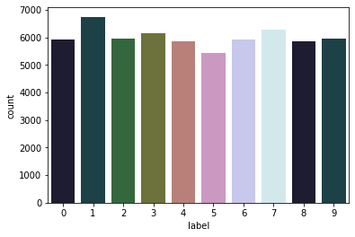

# 组织机器学习项目

终于，我们可以开始构建第一个机器学习模型了。

是这样吗？

在开始之前，我们必须注意几件事。请记住，我们将在集成开发环境/文本编辑器中工作，而不是在 jupyter notebook 中。你也可以在 jupyter notebook 中工作，这完全取决于你。不过，我将只使用 jupyter notebook 来探索数据、绘制图表和图形。我们将以这样一种方式构建分类框架，即插即用。您无需对代码做太多改动就能训练模型，而且当您改进模型时，还能使用 git 对其进行跟踪。

我们首先来看看文件的结构。对于你正在做的任何项目，都要创建一个新文件夹。在本例中，我将项目命名为 "project"。

项目文件夹内部应该如下所示。

- input
  - train.csv
  - test.csv
- src
  - create_folds.py
  - train.py
  - inference.py
  - models.py
  - config.py
  - model_dispatcher.py
- models
  - model_rf.bin
  - model_et.bin
- notebooks
  - exploration.ipynb
  - check_data.ipynb
- README.md
- LICENSE

让我们来看看这些文件夹和文件的内容。

_input/_：该文件夹包含机器学习项目的所有输入文件和数据。如果您正在开发 NLP 项目，您可以将 embeddings 放在这里。如果是图像项目，所有图像都放在该文件夹下的子文件夹中。

_src/_：我们将在这里保存与项目相关的所有 python 脚本。如果我说的是一个 python 脚本，即任何 \*.py 文件，它都存储在 src 文件夹中。

_models/_：该文件夹保存所有训练过的模型。

_notebook/_：所有 jupyter notebook（即任何 \*.ipynb 文件）都存储在笔记本 文件夹中。

_README.md_：这是一个标记符文件，您可以在其中描述您的项目，并写明如何训练模型或在生产环境中使用。

_LICENSE_：这是一个简单的文本文件，包含项目的许可证，如 MIT、Apache 等。关于许可证的详细介绍超出了本书的范围。

假设你正在建立一个模型来对 MNIST 数据集（几乎每本机器学习书籍都会用到的数据集）进行分类。如果你还记得，我们在交叉检验一章中也提到过 MNIST 数据集。所以，我就不解释这个数据集是什么样子了。网上有许多不同格式的 MNIST 数据集，但我们将使用 CSV 格式的数据集。

在这种格式的数据集中，CSV 的每一行都包含图像的标签和 784 个像素值，像素值范围从 0 到 255。数据集包含 60000 张这种格式的图像。

我们可以使用 pandas 轻松读取这种数据格式。

请注意，尽管图 1 显示所有像素值均为零，但事实并非如此。


<p align="center"><b>图 1：CSV格式的 MNIST 数据集</b> </p>

让我们来看看这个数据集中标签列的计数。



<p align="center"><b>图 2：MNIST 数据集中的标签计数</b> </p>

我们不需要对这个数据集进行更多的探索。我们已经知道了我们所拥有的数据，没有必要再对不同的像素值进行绘图。从图 2 中可以清楚地看出，标签的分布相当均匀。因此，我们可以使用准确率/F1 作为衡量标准。这就是处理机器学习问题的第一步：确定衡量标准！

现在，我们可以编写一些代码了。我们需要创建 _src/_ 文件夹和一些 python 脚本。

请注意，训练 CSV 文件位于 _input/_ 文件夹中，名为 _mnist_train.csv_。

对于这样一个项目，这些文件应该是什么样的呢？

首先要创建的脚本是 **create_folds.py**。

这将在 _input/_ 文件夹中创建一个名为 _mnist_train_folds.csv_ 的新文件，与 _mnist_train.csv_ 相同。唯一不同的是，这个 CSV 文件经过了随机排序，并新增了一列名为 _kfold_ 的内容。

一旦我们决定了要使用哪种评估指标并创建了折叠，就可以开始创建基本模型了。这可以在 train.py 中完成。

```python
import joblib
import pandas as pd
from sklearn import metrics
from sklearn import tree
def run(fold):
    # 读取数据文件
    df = pd.read_csv("../input/mnist_train_folds.csv")
    # 选取df中kfold列不等于fold
    df_train = df[df.kfold != fold].reset_index(drop=True)
    # 选取df中kfold列等于fold
    df_valid = df[df.kfold == fold].reset_index(drop=True)
    # 训练集输入，删除label列
    x_train = df_train.drop("label", axis=1).values
    # 训练集输出，取label列
    y_train = df_train.label.values
    # 验证集输入，删除label列
    x_valid = df_valid.drop("label", axis=1).values
    # 验证集输出，取label列
    y_valid = df_valid.label.values
    # 实例化决策树模型
    clf = tree.DecisionTreeClassifier()
    # 使用训练集训练模型
    clf.fit(x_train, y_train)
    # 使用验证集输入得到预测结果
    preds = clf.predict(x_valid)
    # 计算验证集准确率
    accuracy = metrics.accuracy_score(y_valid, preds)
    # 打印fold信息和准确率
    print(f"Fold={fold}, Accuracy={accuracy}")
    # 保存模型
    joblib.dump(clf, f"../models/dt_{fold}.bin")

if __name__ == "__main__":
    # 运行每个折叠
	run(fold=0)
	run(fold=1)
	run(fold=2)
	run(fold=3)
	run(fold=4)
```

您可以在控制台调用 python train.py 运行该脚本。

```python
❯ python train.py
Fold=0, Accuracy=0.8680833333333333
Fold=1, Accuracy=0.8685
Fold=2, Accuracy=0.8674166666666666
Fold=3, Accuracy=0.8703333333333333
Fold=4, Accuracy=0.8699166666666667
```

查看训练脚本时，您会发现还有一些内容是硬编码的，例如折叠数、训练文件和输出文件夹。

因此，我们可以创建一个包含所有这些信息的配置文件：**config.py**。

```python
TRAINING_FILE = "../input/mnist_train_folds.csv"
MODEL_OUTPUT = "../models/"
```

我们还对训练脚本进行了一些修改。训练文件现在使用配置文件。这样，更改数据或模型输出就更容易了。

```python
import os
import config
import joblib
import pandas as pd
from sklearn import metrics
from sklearn import tree
def run(fold):
    # 使用config中的路径读取数据
    df = pd.read_csv(config.TRAINING_FILE)
    df_train = df[df.kfold != fold].reset_index(drop=True)
    df_valid = df[df.kfold == fold].reset_index(drop=True)
    x_train = df_train.drop("label", axis=1).values
    y_train = df_train.label.values
    x_valid = df_valid.drop("label", axis=1).values
    y_valid = df_valid.label.values
    clf = tree.DecisionTreeClassifier()
    clf.fit(x_train, y_train)
    preds = clf.predict(x_valid)
    accuracy = metrics.accuracy_score(y_valid, preds)
    print(f"Fold={fold}, Accuracy={accuracy}")
    joblib.dump(clf,os.path.join(config.MODEL_OUTPUT, f"dt_{fold}.bin") )
if __name__ == "__main__":
    # 运行每个折叠
	run(fold=0)
	run(fold=1)
	run(fold=2)
	run(fold=3)
	run(fold=4)
```

请注意，我并没有展示这个培训脚本与之前脚本的区别。请仔细阅读这两个脚本，自己找出不同之处。区别并不多。

与训练脚本相关的还有一点可以改进。正如你所看到的，我们为每个折叠多次调用运行函数。有时，在同一个脚本中运行多个折叠并不可取，因为内存消耗可能会不断增加，程序可能会崩溃。为了解决这个问题，我们可以向训练脚本传递参数。我喜欢使用 argparse。

```python
import argparse

if __name__ == "__main__":
    # 实例化参数环境
    parser = argparse.ArgumentParser()
    # fold参数
    parser.add_argument( "--fold", type=int)
    # 读取参数
    args = parser.parse_args()
    run(fold=args.fold)
```

现在，我们可以再次运行 python 脚本，但仅限于给定的折叠。

```python
❯ python train.py --fold 0
Fold=0, Accuracy=0.8656666666666667
```

仔细观察，我们的第 0 折得分与之前有些不同。这是因为模型中存在随机性。我们将在后面的章节中讨论如何处理随机性。

现在，如果你愿意，可以创建一个 **shell 脚本**，针对不同的折叠使用不同的命令，然后一起运行，如下图所示。

```python
python train.py --fold 0
python train.py --fold 1
python train.py --fold 2
python train.py --fold 3
python train.py --fold 4
```

您可以通过以下命令运行它。

```python
❯ sh run.sh
Fold=0, Accuracy=0.8675
Fold=1, Accuracy=0.8693333333333333
Fold=2, Accuracy=0.8683333333333333
Fold=3, Accuracy=0.8704166666666666
Fold=4, Accuracy=0.8685
```

我们现在已经取得了一些进展，但如果我们看一下我们的训练脚本，我们仍然受到一些东西的限制，例如模型。模型是硬编码在训练脚本中的，只有修改脚本才能改变它。因此，我们将创建一个新的 python 脚本，名为 **model_dispatcher.py**。model_dispatcher.py，顾名思义，将调度我们的模型到训练脚本中。

```python
from sklearn import tree
models = {
    # 以gini系数度量的决策树
    "decision_tree_gini": tree.DecisionTreeClassifier(
        criterion="gini"
    ),
    # 以entropy系数度量的决策树
    "decision_tree_entropy": tree.DecisionTreeClassifier(
        criterion="entropy"
    ),
}
```

model_dispatcher.py 从 scikit-learn 中导入了 tree，并定义了一个字典，其中键是模型的名称，值是模型本身。在这里，我们定义了两种不同的决策树，一种使用基尼标准，另一种使用熵标准。要使用 py，我们需要对训练脚本做一些修改。

```python
import argparse
import os
import joblib
import pandas as pd
from sklearn import metrics
import config
import model_dispatcher
def run(fold, model):
    df = pd.read_csv(config.TRAINING_FILE)
    df_train = df[df.kfold != fold].reset_index(drop=True)
    df_valid = df[df.kfold == fold].reset_index(drop=True)
	x_train = df_train.drop("label", axis=1).values
	y_train = df_train.label.values
    x_valid = df_valid.drop("label", axis=1).values
	y_valid = df_valid.label.values
    # 根据model参数选择模型
	clf = model_dispatcher.models[model]
    clf.fit(x_train, y_train)
	preds = clf.predict(x_valid)
    accuracy = metrics.accuracy_score(y_valid, preds)
    print(f"Fold={fold}, Accuracy={accuracy}")
    joblib.dump( clf,os.path.join(config.MODEL_OUTPUT, f"dt_{fold}.bin"))

if __name__ == "__main__":
	parser = argparse.ArgumentParser()
    # fold参数
	parser.add_argument("--fold", type=int)
    # model参数
	parser.add_argument("--model", type=str)
    args = parser.parse_args()
    run(fold=args.fold, model=args.model)
```

train.py 有几处重大改动：

- 导入*model_dispatcher*
- 为 ArgumentParser 添加 --model 参数
- 为 run() 函数添加 model 参数
- 使用调度程序获取指定名称的模型

现在，我们可以使用以下命令运行脚本：

```python
❯ python train.py --fold 0 --model decision_tree_gini
Fold=0, Accuracy=0.8665833333333334
```

或执行以下命令

```python
❯ python train.py --fold 0 --model decision_tree_entropy
Fold=0, Accuracy=0.8705833333333334
```

现在，如果要添加新模型，只需修改 _model_dispatcher.py_。让我们尝试添加随机森林，看看准确率会有什么变化。

```python
from sklearn import ensemble
from sklearn import tree
models = {
    "decision_tree_gini": tree.DecisionTreeClassifier(
        criterion="gini"
    ),
    "decision_tree_entropy": tree.DecisionTreeClassifier(
        criterion="entropy"
    ),
    # 随机森林模型
    "rf": ensemble.RandomForestClassifier(),
}
```

让我们运行这段代码。

```python
❯ python train.py --fold 0 --model rf
Fold=0, Accuracy=0.9670833333333333
```

哇，一个简单的改动就能让分数有如此大的提升！现在，让我们使用 _run.sh_ 脚本运行 5 个折叠！

```python
python train.py --fold 0 --model rf
python train.py --fold 1 --model rf
python train.py --fold 2 --model rf
python train.py --fold 3 --model rf
python train.py --fold 4 --model rf
```

得分情况如下

```python
❯ sh run.sh
Fold=0, Accuracy=0.9674166666666667
Fold=1, Accuracy=0.9698333333333333
Fold=2, Accuracy=0.96575
Fold=3, Accuracy=0.9684166666666667
Fold=4, Accuracy=0.9666666666666667
```

MNIST 几乎是每本书和每篇博客都会讨论的问题。但我试图将这个问题转换得更有趣，并向你展示如何为你正在做的或计划在不久的将来做的几乎所有机器学习项目编写一个基本框架。有许多不同的方法可以改进这个 MNIST 模型和这个框架，我们将在以后的章节中看到。

我使用了一些脚本，如 _model_dispatcher.py_ 和 _config.py_，并将它们导入到我的训练脚本中。请注意，我没有使用 `import *` 语法，你也不应该使用。如果我使用了 `import *`，你就永远不会知道模型字典是从哪里来的。编写优秀、易懂的代码是一个人必须具备的基本素质，但许多数据科学家却忽视了这一点。如果你所做的项目能让其他人理解并使用，而无需咨询你的意见，那么你就节省了他们的时间和自己的时间，可以将这些时间投入到改进你的项目或开发新项目中去。
