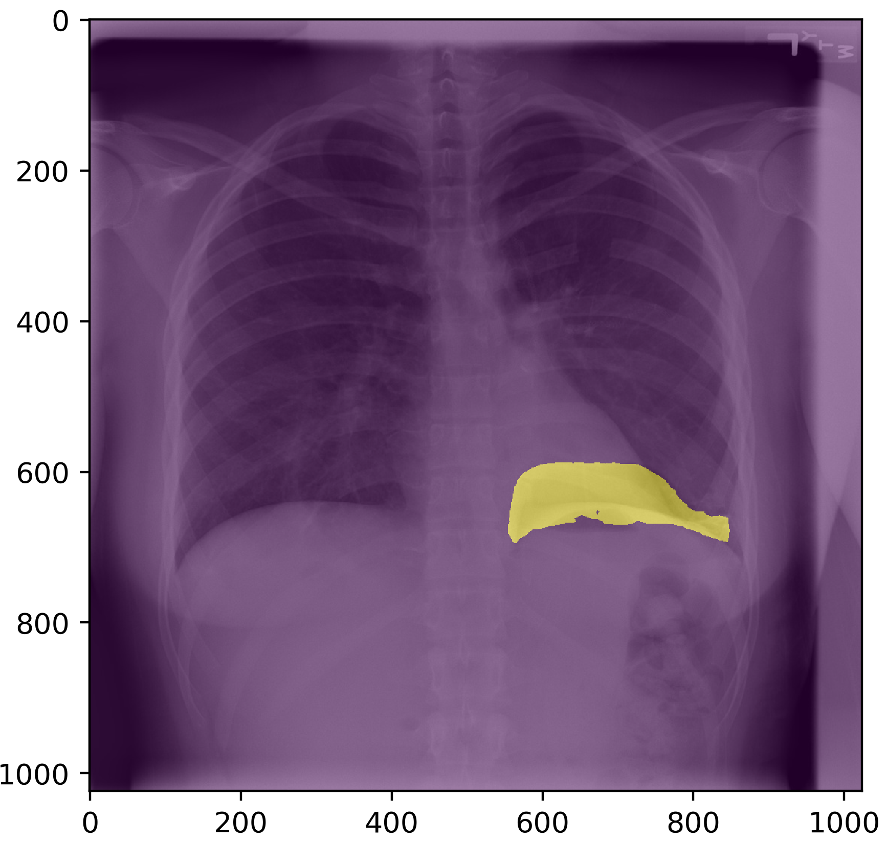
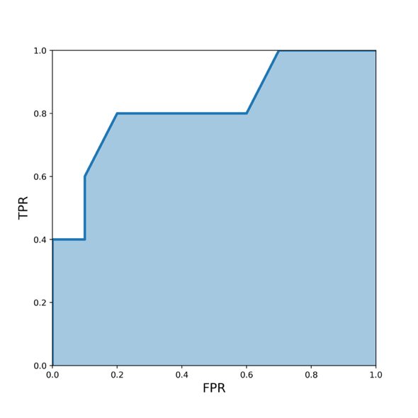
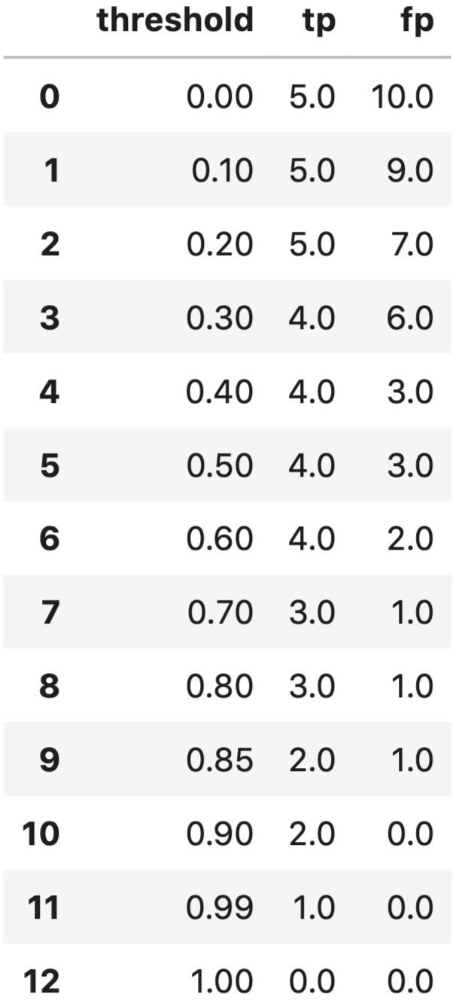
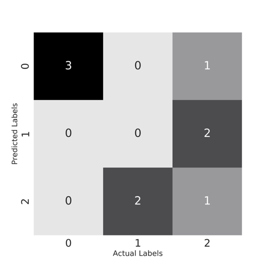

# 评估指标

说到机器学习问题，你会在现实世界中遇到很多不同类型的指标。有时，人们甚至会根据业务问题创建度量标准。逐一介绍和解释每一种度量类型超出了本书的范围。相反，我们将介绍一些最常见的度量标准，供你在最初的几个项目中使用。

在本书的开头，我们介绍了监督学习和非监督学习。虽然无监督学习可以使用一些指标，但我们将只关注有监督学习。这是因为有监督问题比无监督问题多，而且对无监督方法的评估相当主观。

如果我们谈论分类问题，最常用的指标是：

- 准确率（Accuracy）
- 精确率（P）
- 召回率（R）
- F1 分数（F1）
- AUC（AUC）
- 对数损失（Log loss）
- k 精确率（P@k）
- k 平均精率（AP@k）
- k 均值平均精确率（MAP@k）

说到回归，最常用的评价指标是

- 平均绝对误差 （MAE）
- 均方误差 （MSE）
- 均方根误差 （RMSE）
- 均方根对数误差 （RMSLE）
- 平均百分比误差 （MPE）
- 平均绝对百分比误差 （MAPE）
- R2

了解上述指标的工作原理并不是我们必须了解的唯一事情。我们还必须知道何时使用哪些指标，而这取决于你有什么样的数据和目标。我认为这与目标有关，而与数据无关。

要进一步了解这些指标，让我们从一个简单的问题开始。假设我们有一个**二元分类**问题，即只有两个目标的问题，假设这是一个胸部 X 光图像分类问题。有的胸部 X 光图像没有问题，而有的胸部 X 光图像有肺塌陷，也就是所谓的气胸。因此，我们的任务是建立一个分类器，在给定胸部 X 光图像的情况下，它能检测出图像是否有气胸。



<p align="center"><b>图 1：气胸肺部图像</b> </p>

我们还假设有相同数量的气胸和非气胸胸部 X 光图像，比如各 100 张。因此，我们有 100 张阳性样本和 100 张阴性样本，共计 200 张图像。

第一步是将上述数据分为两组，每组 100 张图像，即训练集和验证集。在这两个集合中，我们都有 50 个正样本和 50 个负样本。

在二元分类指标中，当正负样本数量相等时，我们通常使用准确率、精确率、召回率和 F1。

**准确率**：这是机器学习中最直接的指标之一。它定义了模型的准确度。对于上述问题，如果你建立的模型能准确分类 90 张图片，那么你的准确率就是 90% 或 0.90。如果只有 83 幅图像被正确分类，那么模型的准确率就是 83% 或 0.83。

计算准确率的 Python 代码也非常简单。

```python
def accuracy(y_true, y_pred):
    # 为正确预测数初始化一个简单计数器
    correct_counter = 0
    # 遍历y_true，y_pred中所有元素
    for yt, yp in zip(y_true, y_pred):
        if yt == yp:
            # 如果预测标签与真实标签相同，则增加计数器
            correct_counter += 1
    # 返回正确率，正确标签数/总标签数
    return correct_counter / len(y_true)
```

我们还可以使用 scikit-learn 计算准确率。

```python
In [X]: from sklearn import metrics
   ...: l1 = [0,1,1,1,0,0,0,1]
   ...: l2 = [0,1,0,1,0,1,0,0]
   ...: metrics.accuracy_score(l1, l2)
Out[X]: 0.625
```

现在，假设我们把数据集稍微改动一下，有 180 张没有气胸的胸部 X 光图像，只有 20 张有气胸。即使在这种情况下，我们也要创建正负（气胸与非气胸）目标比例相同的训练集和验证集。在每一组中，我们有 90 张非气胸图像和 10 张气胸图像。如果说验证集中的所有图像都是非气胸图像，那么您的准确率会是多少呢？让我们来看看；您对 90% 的图像进行了正确分类。因此，您的准确率是 90%。

但请再看一遍。

你甚至没有建立一个模型，就得到了 90% 的准确率。这似乎有点没用。如果我们仔细观察，就会发现数据集是偏斜的，也就是说，一个类别中的样本数量比另一个类别中的样本数量多很多。在这种情况下，使用准确率作为评估指标是不可取的，因为它不能代表数据。因此，您可能会获得很高的准确率，但您的模型在实际样本中的表现可能并不理想，而且您也无法向经理解释原因。

在这种情况下，最好还是看看**精确率**等其他指标。

在学习精确率之前，我们需要了解一些术语。在这里，我们假设有气胸的胸部 X 光图像为正类 (1)，没有气胸的为负类 (0)。

**真阳性 （TP）**： 给定一幅图像，如果您的模型预测该图像有气胸，而该图像的实际目标有气胸，则视为真阳性。

**真阴性 （TN）**： 给定一幅图像，如果您的模型预测该图像没有气胸，而实际目标显示该图像没有气胸，则视为真阴性。

简单地说，如果您的模型正确预测了阳性类别，它就是真阳性；如果您的模型准确预测了阴性类别，它就是真阴性。

**假阳性 （FP）**：给定一张图像，如果您的模型预测为气胸，而该图像的实际目标是非气胸，则为假阳性。

**假阴性 （FN）**： 给定一幅图像，如果您的模型预测为非气胸，而该图像的实际目标是气胸，则为假阴性。

简单地说，如果您的模型错误地（或虚假地）预测了阳性类，那么它就是假阳性。如果模型错误地（或虚假地）预测了阴性类别，则是假阴性。

让我们逐一看看这些实现。

```python
def true_positive(y_true, y_pred):
    # 初始化真阳性样本计数器
    tp = 0
    # 遍历y_true，y_pred中所有元素
    for yt, yp in zip(y_true, y_pred):
        # 若真实标签为正类且预测标签也为正类，计数器增加
        if yt == 1 and yp == 1:
            tp += 1
    # 返回真阳性样本数
    return tp

def true_negative(y_true, y_pred):
    # 初始化真阴性样本计数器
    tn = 0
    # 遍历y_true，y_pred中所有元素
    for yt, yp in zip(y_true, y_pred):
         # 若真实标签为负类且预测标签也为负类，计数器增加
        if yt == 0 and yp == 0:
            tn += 1
    # 返回真阴性样本数
    return tn

def false_positive(y_true, y_pred):
    # 初始化假阳性计数器
    fp = 0
    # 遍历y_true，y_pred中所有元素
    for yt, yp in zip(y_true, y_pred):
        # 若真实标签为负类而预测标签为正类，计数器增加
        if yt == 0 and yp == 1:
            fp += 1
    # 返回假阳性样本数
    return fp

def false_negative(y_true, y_pred):
    # 初始化假阴性计数器
    fn = 0
    # 遍历y_true，y_pred中所有元素
    for yt, yp in zip(y_true, y_pred):
        # 若真实标签为正类而预测标签为负类，计数器增加
        if yt == 1 and yp == 0:
            fn += 1
    # 返回假阴性数
	return fn
```

我在这里实现这些功能的方法非常简单，而且只适用于二元分类。让我们检查一下这些函数。

```python
In [X]: l1 = [0,1,1,1,0,0,0,1]
   ...: l2 = [0,1,0,1,0,1,0,0]
In [X]: true_positive(l1, l2)
Out[X]: 2
In [X]: false_positive(l1, l2)
Out[X]: 1
In [X]: false_negative(l1, l2)
Out[X]: 2
In [X]: true_negative(l1, l2)
Out[X]: 3
```

如果我们必须用上述术语来定义精确率，我们可以写为：

$$
Accuracy Score = (TP + TN)/(TP + TN + FP +FN)
$$

现在，我们可以在 python 中使用 TP、TN、FP 和 FN 快速实现准确度得分。我们将其称为 accuracy_v2。

```python
def accuracy_v2(y_true, y_pred):
    # 真阳性样本数
    tp = true_positive(y_true, y_pred)
    # 假阳性样本数
    fp = false_positive(y_true, y_pred)
    # 假阴性样本数
    fn = false_negative(y_true, y_pred)
    # 真阴性样本数
    tn = true_negative(y_true, y_pred)
    # 准确率
    accuracy_score = (tp + tn) / (tp + tn + fp + fn)
return accuracy_score
```

我们可以通过与之前的实现和 scikit-learn 版本进行比较，快速检查该函数的正确性。

```python
In [X]: l1 = [0,1,1,1,0,0,0,1]
   ...: l2 = [0,1,0,1,0,1,0,0]
In [X]: accuracy(l1, l2)
Out[X]: 0.625
In [X]: accuracy_v2(l1, l2)
Out[X]: 0.625
In [X]: metrics.accuracy_score(l1, l2)
Out[X]: 0.625
```

请注意，在这段代码中，metrics.accuracy_score 来自 scikit-learn。

很好。所有值都匹配。这说明我们在实现过程中没有犯任何错误。

现在，我们可以转向其他重要指标。

首先是精确率。精确率的定义是

$$
Precision = TP/(TP + FP)
$$

假设我们在新的偏斜数据集上建立了一个新模型，我们的模型正确识别了 90 张图像中的 80 张非气胸图像和 10 张图像中的 8 张气胸图像。因此，我们成功识别了 100 张图像中的 88 张。因此，准确率为 0.88 或 88%。

但是，在这 100 张样本中，有 10 张非气胸图像被误判为气胸，2 张气胸图像被误判为非气胸。

因此，我们有

- TP : 8
- TN: 80
- FP: 10
- FN: 2

精确率为 8 / (8 + 10) = 0.444。这意味着我们的模型在识别阳性样本（气胸）时有 44.4% 的正确率。

现在，既然我们已经实现了 TP、TN、FP 和 FN，我们就可以很容易地在 python 中实现精确率了。

```python
def precision(y_true, y_pred):
    # 真阳性样本数
    tp = true_positive(y_true, y_pred)
    # 假阳性样本数
    fp = false_positive(y_true, y_pred)
    # 精确率
    precision = tp / (tp + fp)
    return precision
```

让我们试试这种精确率的实现方式。

```python
In [X]: l1 = [0,1,1,1,0,0,0,1]
   ...: l2 = [0,1,0,1,0,1,0,0]
In [X]: precision(l1, l2)
Out[X]: 0.6666666666666666
```

这似乎没有问题。 接下来，我们来看**召回率**。召回率的定义是：

$$
Recall = TP/(TP + FN)
$$

在上述情况下，召回率为 8 / (8 + 2) = 0.80。这意味着我们的模型正确识别了 80% 的阳性样本。

```python
def recall(y_true, y_pred):
    # 真阳性样本数
    tp = true_positive(y_true, y_pred)
    # 假阴性样本数
    fn = false_negative(y_true, y_pred)
    # 召回率
    recall = tp / (tp + fn)
    return recall
```

就我们的两个小列表而言，召回率应该是 0.5。让我们检查一下。

```python
In [X]: l1 = [0,1,1,1,0,0,0,1]
   ...: l2 = [0,1,0,1,0,1,0,0]
In [X]: recall(l1, l2)
Out[X]: 0.5
```

这与我们的计算值相符！

对于一个 "好 "模型来说，精确率和召回值都应该很高。我们看到，在上面的例子中，召回值相当高。但是，精确率却很低！我们的模型产生了大量的误报，但误报较少。在这类问题中，假阴性较少是好事，因为你不想在病人有气胸的情况下却说他们没有气胸。这样做会造成更大的伤害。但我们也有很多假阳性结果，这也不是好事。

大多数模型都会预测一个概率，当我们预测时，通常会将这个阈值选为 0.5。这个阈值并不总是理想的，根据这个阈值，精确率和召回率的值可能会发生很大的变化。如果我们选择的每个阈值都能计算出精确率和召回率，那么我们就可以在这些值之间绘制出曲线图。这幅图或曲线被称为 "精确率-召回率曲线"。

在研究精确率-调用曲线之前，我们先假设有两个列表。

```python
In [X]: y_true = [0, 0, 0, 1, 0, 0, 0, 0, 0, 0,
   ...:          1, 0, 0, 0, 0, 0, 0, 0, 1, 0]
In [X]: y_pred = [0.02638412, 0.11114267, 0.31620708,
   ...:          0.0490937, 0.0191491, 0.17554844,
   ...:          0.15952202, 0.03819563, 0.11639273,
   ...:          0.079377,  0.08584789, 0.39095342,
   ...:          0.27259048, 0.03447096, 0.04644807,
   ...:          0.03543574, 0.18521942, 0.05934905,
   ...:          0.61977213, 0.33056815]
```

因此，y_true 是我们的目标值，而 y_pred 是样本被赋值为 1 的概率值。因此，现在我们要看的是预测中的概率，而不是预测值（大多数情况下，预测值的计算阈值为 0.5）。

```python
precisions = []
recalls = []
thresholds = [0.0490937 , 0.05934905, 0.079377,
              0.08584789, 0.11114267, 0.11639273,
              0.15952202, 0.17554844, 0.18521942,
              0.27259048, 0.31620708, 0.33056815,
              0.39095342, 0.61977213]

# 遍历预测阈值
for i in thresholds:
    # 若样本为正类（1）的概率大于阈值，为1，否则为0
    temp_prediction = [1 if x >= i else 0 for x in y_pred]
    # 计算精确率
    p = precision(y_true, temp_prediction)
    # 计算召回率
    r = recall(y_true, temp_prediction)
    # 加入精确率列表
    precisions.append(p)
    # 加入召回率列表
    recalls.append(r)
```

现在，我们可以绘制精确率-召回率曲线。

```python
# 创建画布
plt.figure(figsize=(7, 7))
# x轴为召回率，y轴为精确率
plt.plot(recalls, precisions)
# 添加x轴标签，字体大小为15
plt.xlabel('Recall', fontsize=15)
# 添加y轴标签，字条大小为15
plt.ylabel('Precision', fontsize=15)
```

图 2 显示了我们通过这种方法得到的精确率-召回率曲线。


<p align="center"><b>图 2：精确率-召回率曲线</b> </p>

这条**精确率-召回率曲线**与您在互联网上看到的曲线截然不同。这是因为我们只有 20 个样本，其中只有 3 个是阳性样本。但这没什么好担心的。这还是那条精确率-召回曲线。

你会发现，选择一个既能提供良好精确率又能提供召回值的阈值是很有挑战性的。如果阈值过高，真阳性的数量就会减少，而假阴性的数量就会增加。这会降低召回率，但精确率得分会很高。如果将阈值降得太低，则误报会大量增加，精确率也会降低。

精确率和召回率的范围都是从 0 到 1，越接近 1 越好。

F1 分数是精确率和召回率的综合指标。它被定义为精确率和召回率的简单加权平均值（调和平均值）。如果我们用 P 表示精确率，用 R 表示召回率，那么 F1 分数可以表示为：

$$
F1 = 2PR/(P + R)
$$

根据 TP、FP 和 FN，稍加数学计算就能得出以下 F1 等式：

$$
F1 = 2TP/(2TP + FP + FN)
$$

Python 实现很简单，因为我们已经实现了这些

```python
def f1(y_true, y_pred):
    # 计算精确率
    p = precision(y_true, y_pred)
    # 计算召回率
    r = recall(y_true, y_pred)
    # 计算f1值
    score = 2 * p * r / (p + r)
    return score
```

让我们看看其结果，并与 scikit-learn 进行比较。

```python
In [X]: y_true = [0, 0, 0, 1, 0, 0, 0, 0, 0, 0,
   ...:          1, 0, 0, 0, 0, 0, 0, 0, 1, 0]
In [X]: y_pred = [0, 0, 1, 0, 0, 0, 1, 0, 0, 0,
   ...:          1, 0, 0, 0, 0, 0, 0, 0, 1, 0]
In [X]: f1(y_true, y_pred)
Out[X]: 0.5714285714285715
```

通过 scikit learn，我们可以得到相同的列表：

```python
In [X]: from sklearn import metrics
In [X]: metrics.f1_score(y_true, y_pred)
Out[X]: 0.5714285714285715
```

与其单独看精确率和召回率，您还可以只看 F1 分数。与精确率、召回率和准确度一样，F1 分数的范围也是从 0 到 1，完美预测模型的 F1 分数为 1。

此外，我们还应该了解其他一些关键术语。

第一个术语是 TPR 或真阳性率（True Positive Rate），它与召回率相同。

$$
TPR = TP/(TP + FN)
$$

尽管它与召回率相同，但我们将为它创建一个 python 函数，以便今后使用这个名称。

```python
def tpr(y_true, y_pred):
    # 真阳性率（TPR），与召回率计算公式一致
	return recall(y_true, y_pred)
```

TPR 或召回率也被称为灵敏度。

而 FPR 或假阳性率（False Positive Rate）的定义是：

$$
FPR = FP / (TN + FP)
$$

```python
def fpr(y_true, y_pred):
    # 假阳性样本数
    fp = false_positive(y_true, y_pred)
    # 真阴性样本数
    tn = true_negative(y_true, y_pred)
# 返回假阳性率（FPR）
return fp / (tn + fp)
```

1 - FPR 被称为特异性或真阴性率或 TNR。这些术语很多，但其中最重要的只有 TPR 和 FPR。假设我们只有 15 个样本，其目标值为二元：

Actual targets : [0, 0, 0, 0, 1, 0, 1, 0, 0, 1, 0, 1, 0, 0, 1, 0, 1]

我们训练一个类似随机森林的模型，就能得到样本呈阳性的概率。

Predicted probabilities for 1: [0.1, 0.3, 0.2, 0.6, 0.8, 0.05, 0.9, 0.5, 0.3, 0.66, 0.3, 0.2, 0.85, 0.15, 0.99]

对于 >= 0.5 的典型阈值，我们可以评估上述所有精确率、召回率/TPR、F1 和 FPR 值。但是，如果我们将阈值选为 0.4 或 0.6，也可以做到这一点。事实上，我们可以选择 0 到 1 之间的任何值，并计算上述所有指标。

不过，我们只计算两个值： TPR 和 FPR。

```python
# 初始化真阳性率列表
tpr_list = []
# 初始化假阳性率列表
fpr_list = []

# 真实样本标签
y_true = [0, 0, 0, 0, 1, 0, 1,
          0, 0, 1, 0, 1, 0, 0, 1]

# 预测样本为正类（1）的概率
y_pred = [0.1, 0.3, 0.2, 0.6, 0.8, 0.05,
          0.9, 0.5, 0.3, 0.66, 0.3, 0.2,
          0.85, 0.15, 0.99]

# 预测阈值
thresholds = [0, 0.1, 0.2, 0.3, 0.4, 0.5,
              0.6, 0.7, 0.8, 0.85, 0.9, 0.99, 1.0]

# 遍历预测阈值
for thresh in thresholds:
    # 若样本为正类（1）的概率大于阈值，为1，否则为0
    temp_pred = [1 if x >= thresh else 0 for x in y_pred]
    # 真阳性率
    temp_tpr = tpr(y_true, temp_pred)
    # 假阳性率
    temp_fpr = fpr(y_true, temp_pred)
    # 将真阳性率加入列表
    tpr_list.append(temp_tpr)
    # 将假阳性率加入列表
    fpr_list.append(temp_fpr)
```

因此，我们可以得到每个阈值的 TPR 值和 FPR 值。


<p align="center"><b>图 3：阈值、TPR 和 FPR 值表</b> </p>

如果我们绘制如图 3 所示的表格，即以 TPR 为 Y 轴，FPR 为 X 轴，就会得到如图 4 所示的曲线。



<p align="center"><b>图 4：ROC曲线</b> </p>

这条曲线也被称为 ROC 曲线。如果我们计算这条 ROC 曲线下的面积，就是在计算另一个指标，当数据集的二元目标偏斜时，这个指标就会非常常用。

这个指标被称为 ROC 曲线下面积或曲线下面积，简称 AUC。计算 ROC 曲线下面积的方法有很多。在此，我们将采用 scikit- learn 的奇妙实现方法。

```python
In [X]: from sklearn import metrics
In [X]: y_true = [0, 0, 0, 0, 1, 0, 1,
   ...:          0, 0, 1, 0, 1, 0, 0, 1]
In [X]: y_pred = [0.1, 0.3, 0.2, 0.6, 0.8, 0.05,
   ...:          0.9, 0.5, 0.3, 0.66, 0.3, 0.2,
   ...:          0.85, 0.15, 0.99]
In [X]: metrics.roc_auc_score(y_true, y_pred)
Out[X]: 0.8300000000000001
```

AUC 值从 0 到 1 不等。

- AUC = 1 意味着您拥有一个完美的模型。大多数情况下，这意味着你在验证时犯了一些错误，应该重新审视数据处理和验证流程。如果你没有犯任何错误，那么恭喜你，你已经拥有了针对数据集建立的最佳模型。
- AUC = 0 意味着您的模型非常糟糕（或非常好！）。试着反转预测的概率，例如，如果您预测正类的概率是 p，试着用 1-p 代替它。这种 AUC 也可能意味着您的验证或数据处理存在问题。
- AUC = 0.5 意味着你的预测是随机的。因此，对于任何二元分类问题，如果我将所有目标都预测为 0.5，我将得到 0.5 的 AUC。

AUC 值介于 0 和 0.5 之间，意味着你的模型比随机模型更差。大多数情况下，这是因为你颠倒了类别。 如果您尝试反转预测，您的 AUC 值可能会超过 0.5。接近 1 的 AUC 值被认为是好值。

但 AUC 对我们的模型有什么影响呢？

假设您建立了一个从胸部 X 光图像中检测气胸的模型，其 AUC 值为 0.85。这意味着，如果您从数据集中随机选择一张有气胸的图像（阳性样本）和另一张没有气胸的图像（阴性样本），那么气胸图像的排名将高于非气胸图像，概率为 0.85。

计算概率和 AUC 后，您需要对测试集进行预测。根据问题和使用情况，您可能需要概率或实际类别。如果你想要概率，这并不难。如果您想要类别，则需要选择一个阈值。在二元分类的情况下，您可以采用类似下面的方法。

$$
Prediction = Probability >= Threshold
$$

也就是说，预测是一个只包含二元变量的新列表。如果概率大于或等于给定的阈值，则预测中的一项为 1，否则为 0。

你猜怎么着，你可以使用 ROC 曲线来选择这个阈值！ROC 曲线会告诉您阈值对假阳性率和真阳性率的影响，进而影响假阳性和真阳性。您应该选择最适合您的问题和数据集的阈值。

例如，如果您不希望有太多的误报，那么阈值就应该高一些。不过，这也会带来更多的误报。注意权衡利弊，选择最佳阈值。让我们看看这些阈值如何影响真阳性和假阳性值。

```python
# 真阳性样本数列表
tp_list = []
# 假阳性样本数列表
fp_list = []

# 真实标签
y_true = [0, 0, 0, 0, 1, 0, 1,
          0, 0, 1, 0, 1, 0, 0, 1]

# 预测样本为正类（1）的概率
y_pred = [0.1, 0.3, 0.2, 0.6, 0.8, 0.05,
          0.9, 0.5, 0.3, 0.66, 0.3, 0.2,
          0.85, 0.15, 0.99]

# 预测阈值
thresholds = [0, 0.1, 0.2, 0.3, 0.4, 0.5,
              0.6, 0.7, 0.8, 0.85, 0.9, 0.99, 1.0]

# 遍历预测阈值
for thresh in thresholds:
    # 若样本为正类（1）的概率大于阈值，为1，否则为0
    temp_pred = [1 if x >= thresh else 0 for x in y_pred]
    # 真阳性样本数
    temp_tp = true_positive(y_true, temp_pred)
    # 假阳性样本数
    temp_fp = false_positive(y_true, temp_pred)
    # 加入真阳性样本数列表
    tp_list.append(temp_tp)
    # 加入假阳性样本数列表
    fp_list.append(temp_fp)
```

利用这一点，我们可以创建一个表格，如图 5 所示。



<p align="center"><b>图 5：不同阈值的 TP 值和 FP 值</b> </p>

如图 6 所示，大多数情况下，ROC 曲线左上角的值应该是一个相当不错的阈值。

对比表格和 ROC 曲线，我们可以发现，0.6 左右的阈值相当不错，既不会丢失大量的真阳性结果，也不会出现大量的假阳性结果。


<p align="center"><b>图 6：从 ROC 曲线最左侧的顶点选择最佳阈值</b> </p>

AUC 是业内广泛应用于偏斜二元分类任务的指标，也是每个人都应该了解的指标。一旦理解了 AUC 背后的理念（如上文所述），也就很容易向业界可能会评估您的模型的非技术人员解释它了。

学习 AUC 后，你应该学习的另一个重要指标是对数损失。对于二元分类问题，我们将对数损失定义为：

$$
LogLoss = -1.0 \times (target \times log(prediction) + (1-target) \times log(1-prediction))
$$

其中，目标值为 0 或 1，预测值为样本属于类别 1 的概率。

对于数据集中的多个样本，所有样本的对数损失只是所有单个对数损失的平均值。需要记住的一点是，对数损失会对不正确或偏差较大的预测进行相当高的惩罚，也就是说，对数损失会对非常确定和非常错误的预测进行惩罚。

```python
import numpy as np
def log_loss(y_true, y_proba):
    # 极小值，防止0做分母
    epsilon = 1e-15

    # 对数损失列表
    loss = []
    # 遍历y_true，y_pred中所有元素
    for yt, yp in zip(y_true, y_proba):
        # 限制yp范围，最小为epsilon，最大为1-epsilon
        yp = np.clip(yp, epsilon, 1 - epsilon)
        # 计算对数损失
        temp_loss = - 1.0 * (yt * np.log(yp)+ (1 - yt) * np.log(1 - yp))
        # 加入对数损失列表
        loss.append(temp_loss)
	return np.mean(loss)
```

让我们测试一下函数执行情况：

```python
In [X]: y_true = [0, 0, 0, 0, 1, 0, 1,
   ...:          0, 0, 1, 0, 1, 0, 0, 1]
In [X]: y_proba = [0.1, 0.3, 0.2, 0.6, 0.8, 0.05,
   ...:          0.9, 0.5, 0.3, 0.66, 0.3, 0.2,
   ...:          0.85, 0.15, 0.99]
In [X]: log_loss(y_true, y_proba)
Out[X]: 0.49882711861432294
```

我们可以将其与 scikit-learn 进行比较：

```python
In [X]: from sklearn import metrics
In [X]: metrics.log_loss(y_true, y_proba)
Out[X]: 0.49882711861432294
```

因此，我们的实现是正确的。 对数损失的实现很容易。解释起来似乎有点困难。你必须记住，对数损失的惩罚要比其他指标大得多。

例如，如果您有 51% 的把握认为样本属于第 1 类，那么对数损失就是：

$$
-1.0 \times (1 \times log(0.51) + (1 - 1) \times log(1 - 0.51))=0.67
$$

如果你对属于 0 类的样本有 49% 的把握，对数损失就是：

$$
-1.0 \times (1 \times log(0.49) + (1 - 1) \times log(1 - 0.49))=0.67
$$

因此，即使我们可以选择 0.5 的截断值并得到完美的预测结果，我们仍然会有非常高的对数损失。因此，在处理对数损失时，你需要非常小心；任何不确定的预测都会产生非常高的对数损失。

我们之前讨论过的大多数指标都可以转换成多类版本。这个想法很简单。以精确率和召回率为例。我们可以计算多类分类问题中每一类的精确率和召回率。

有三种不同的计算方法，有时可能会令人困惑。假设我们首先对精确率感兴趣。我们知道，精确率取决于真阳性和假阳性。

- **宏观平均精确率**（Macro averaged precision）：分别计算所有类别的精确率然后求平均值
- **微观平均精确率**（Micro averaged precision）：按类计算真阳性和假阳性，然后用其计算总体精确率。然后以此计算总体精确率
- **加权精确率**（Weighted precision）：与宏观精确率相同，但这里是加权平均精确率 取决于每个类别中的项目数

这看似复杂，但在 python 实现中很容易理解。让我们看看宏观平均精确率是如何实现的。

```python
import numpy as np
def macro_precision(y_true, y_pred):
    # 种类数
    num_classes = len(np.unique(y_true))
    # 初始化精确率
    precision = 0
    # 遍历0~（种类数-1）
    for class_ in range(num_classes):
        # 若真实标签为class_为1，否则为0
        temp_true = [1 if p == class_ else 0 for p in y_true]
        # 如预测标签为class_为1，否则为0
        temp_pred = [1 if p == class_ else 0 for p in y_pred]
        # 真阳性样本数
        tp = true_positive(temp_true, temp_pred)
        # 假阳性样本数
        fp = false_positive(temp_true, temp_pred)
        # 计算精确度
        temp_precision = tp / (tp + fp)
        # 各类精确率相加
        precision += temp_precision
    # 计算平均值
    precision /= num_classes
	return precision
```

你会发现这并不难。同样，我们还有微平均精确率分数。

```python
import numpy as np
def micro_precision(y_true, y_pred):
    # 种类数
    num_classes = len(np.unique(y_true))
    # 初始化真阳性样本数
    tp = 0
    # 初始化假阳性样本数
    fp = 0
    # 遍历0~（种类数-1）
    for class_ in range(num_classes):
        # 若真实标签为class_为1，否则为0
        temp_true = [1 if p == class_ else 0 for p in y_true]
        # 若预测标签为class_为1，否则为0
        temp_pred = [1 if p == class_ else 0 for p in y_pred]
        # 真阳性样本数相加
        tp += true_positive(temp_true, temp_pred)
        # 假阳性样本数相加
        fp += false_positive(temp_true, temp_pred)
    # 精确率
	precision = tp / (tp + fp)
	return precision
```

这也不难。那什么难？什么都不难。机器学习很简单。现在，让我们来看看加权精确率的实现。

```python
from collections import Counter
import numpy as np
def weighted_precision(y_true, y_pred):
    # 种类数
    num_classes = len(np.unique(y_true))
    # 统计各种类样本数
    class_counts = Counter(y_true)
    # 初始化精确率
    precision = 0
    # 遍历0~（种类数-1）
    for class_ in range(num_classes):
        # 若真实标签为class_为1，否则为0
        temp_true = [1 if p == class_ else 0 for p in y_true]
        # 若预测标签为class_为1，否则为0
        temp_pred = [1 if p == class_ else 0 for p in y_pred]
        # 真阳性样本数
        tp = true_positive(temp_true, temp_pred)
        # 假阳性样本数
        fp = false_positive(temp_true, temp_pred)
        # 精确率
        temp_precision = tp / (tp + fp)
        # 根据该种类样本数分配权重
        weighted_precision = class_counts[class_] * temp_precision
        # 加权精确率求和
        precision += weighted_precision
    # 计算平均精确率
	overall_precision = precision / len(y_true)
	return overall_precision
```

将我们的实现与 scikit-learn 进行比较，以了解实现是否正确。

```python
In [X]: from sklearn import metrics
In [X]: y_true = [0, 1, 2, 0, 1, 2, 0, 2, 2]
In [X]: y_pred = [0, 2, 1, 0, 2, 1, 0, 0, 2]
In [X]: macro_precision(y_true, y_pred)
Out[X]: 0.3611111111111111
In [X]: metrics.precision_score(y_true, y_pred, average="macro")
Out[X]: 0.3611111111111111
In [X]: micro_precision(y_true, y_pred)
Out[X]: 0.4444444444444444
In [X]: metrics.precision_score(y_true, y_pred, average="micro")
Out[X]: 0.4444444444444444
In [X]: weighted_precision(y_true, y_pred)
Out[X]: 0.39814814814814814
In [X]: metrics.precision_score(y_true, y_pred, average="weighted")
Out[X]: 0.39814814814814814
```

看来我们已经正确地实现了一切。 请注意，这里展示的实现可能不是最有效的，但却是最容易理解的。

同样，我们也可以实现**多类别的召回率指标**。精确率和召回率取决于真阳性、假阳性和假阴性，而 F1 则取决于精确率和召回率。

召回率的实现方法留待读者练习，这里实现的是多类 F1 的一个版本，即加权平均值。

```python
from collections import Counter
import numpy as np
def weighted_f1(y_true, y_pred):
    # 种类数
    num_classes = len(np.unique(y_true))
    # 统计各种类样本数
    class_counts = Counter(y_true)
    # 初始化F1值
    f1 = 0
    # 遍历0~（种类数-1）
    for class_ in range(num_classes):
        # 若真实标签为class_为1，否则为0
        temp_true = [1 if p == class_ else 0 for p in y_true]
        # 若预测标签为class_为1，否则为0
        temp_pred = [1 if p == class_ else 0 for p in y_pred]
        # 计算精确率
        p = precision(temp_true, temp_pred)
        # 计算召回率
        r = recall(temp_true, temp_pred)
        # 若精确率+召回率不为0，则使用公式计算F1值
        if p + r != 0:
            temp_f1 = 2 * p * r / (p + r)
        # 否则直接为0
        else:
            temp_f1 = 0
        # 根据样本数分配权重
		weighted_f1 = class_counts[class_] * temp_f1
        # 加权F1值相加
        f1 += weighted_f1
    # 计算加权平均F1值
    overall_f1 = f1 / len(y_true)
	return overall_f1
```

请注意，上面有几行代码是新写的。因此，你应该仔细阅读这些代码。

```python
In [X]: from sklearn import metrics
In [X]: y_true = [0, 1, 2, 0, 1, 2, 0, 2, 2]
In [X]: y_pred = [0, 2, 1, 0, 2, 1, 0, 0, 2]
In [X]: weighted_f1(y_true, y_pred)
Out[X]: 0.41269841269841273
In [X]: metrics.f1_score(y_true, y_pred, average="weighted")
Out[X]: 0.41269841269841273
```

因此，我们已经为多类问题实现了精确率、召回率和 F1。同样，您也可以将 AUC 和对数损失转换为多类格式。这种转换格式被称为 **one-vs-all**。这里我不打算实现它们，因为实现方法与我们已经讨论过的很相似。

在二元或多类分类中，看一下**混淆矩阵**也很流行。不要困惑，这很简单。混淆矩阵只不过是一个包含 TP、FP、TN 和 FN 的表格。使用混淆矩阵，您可以快速查看有多少样本被错误分类，有多少样本被正确分类。也许有人会说，混淆矩阵应该在本章很早就讲到，但我没有这么做。如果了解了 TP、FP、TN、FN、精确率、召回率和 AUC，就很容易理解和解释混淆矩阵了。让我们看看图 7 中二元分类问题的混淆矩阵。

我们可以看到，混淆矩阵由 TP、FP、FN 和 TN 组成。我们只需要这些值来计算精确率、召回率、F1 分数和 AUC。有时，人们也喜欢把 FP 称为**第一类错误**，把 FN 称为**第二类错误**。


<p align="center"><b>图 7：二元分类任务的混淆矩阵</b> </p>

我们还可以将二元混淆矩阵扩展为多类混淆矩阵。它会是什么样子呢？如果我们有 N 个类别，它将是一个大小为 NxN 的矩阵。对于每个类别，我们都要计算相关类别和其他类别的样本总数。举个例子可以让我们更好地理解这一点。

假设我们有以下真实标签：

$$
[0, 1, 2, 0, 1, 2, 0, 2, 2]
$$

我们的预测标签是：

$$
[0, 2, 1, 0, 2, 1, 0, 0, 2]
$$

那么，我们的混淆矩阵将如图 8 所示。



<p align="center"><b>图 8：多分类问题的混淆矩阵</b> </p>

图 8 说明了什么？

让我们来看看 0 类。我们看到，在真实标签中，有 3 个样本属于 0 类。然而，在预测中，我们有 3 个样本属于第 0 类，1 个样本属于第 1 类。理想情况下，对于真实标签中的类别 0，预测标签 1 和 2 应该没有任何样本。让我们看看类别 2。在真实标签中，这个数字加起来是 4，而在预测标签中，这个数字加起来是 3。

一个完美的混淆矩阵只能从左到右斜向填充。

**混淆矩阵**提供了一种简单的方法来计算我们之前讨论过的不同指标。Scikit-learn 提供了一种简单直接的方法来生成混淆矩阵。请注意，我在图 8 中显示的混淆矩阵是 scikit-learn 混淆矩阵的转置，原始版本可以通过以下代码绘制。

```python
import matplotlib.pyplot as plt
import seaborn as sns
from sklearn import metrics

# 真实样本标签
y_true = [0, 1, 2, 0, 1, 2, 0, 2, 2]
# 预测样本标签
y_pred = [0, 2, 1, 0, 2, 1, 0, 0, 2]

# 计算混淆矩阵
cm = metrics.confusion_matrix(y_true, y_pred)

# 创建画布
plt.figure(figsize=(10, 10))
# 创建方格
cmap = sns.cubehelix_palette(50, hue=0.05, rot=0, light=0.9, dark=0,
as_cmap=True)
# 规定字体大小
sns.set(font_scale=2.5)
# 绘制热图
sns.heatmap(cm, annot=True, cmap=cmap, cbar=False)
# y轴标签，字体大小为20
plt.ylabel('Actual Labels', fontsize=20)
# x轴标签，字体大小为20
plt.xlabel('Predicted Labels', fontsize=20)
```

因此，到目前为止，我们已经解决了二元分类和多类分类的度量问题。接下来，我们将讨论另一种类型的分类问题，即多标签分类。在多标签分类中，每个样本都可能与一个或多个类别相关联。这类问题的一个简单例子就是要求你预测给定图像中的不同物体。

图 9 显示了一个著名数据集的图像示例。请注意，该数据集的目标有所不同，但我们暂且不去讨论它。我们假设其目的只是预测图像中是否存在某个物体。在图 9 中，我们有椅子、花盆、窗户，但没有其他物体，如电脑、床、电视等。因此，一幅图像可能有多个相关目标。这类问题就是多标签分类问题。


<p align="center"><b>图 9：图像中的不同物体</b> </p>

这类分类问题的衡量标准有些不同。一些合适的 最常见的指标有：

- k 精确率（P@k）
- k 平均精确率（AP@k）
- k 均值平均精确率（MAP@k）
- 对数损失（Log loss）

让我们从**k 精确率或者 P@k**我们不能将这一精确率与前面讨论的精确率混淆。如果您有一个给定样本的原始类别列表和同一个样本的预测类别列表，那么精确率的定义就是预测列表中仅考虑前 k 个预测结果的命中数除以 k。

如果您对此感到困惑，使用 python 代码后就会明白。

```python
def pk(y_true, y_pred, k):
    # 如果k为0
    if k == 0:
        # 返回0
        return 0
    # 取预测标签前k个
    y_pred = y_pred[:k]
    # 将预测标签转换为集合
    pred_set = set(y_pred)
    # 将真实标签转换为集合
    true_set = set(y_true)
    # 预测标签集合与真实标签集合交集
    common_values = pred_set.intersection(true_set)
    # 计算精确率
    return len(common_values) / len(y_pred[:k])
```

有了代码，一切都变得更容易理解了。

现在，我们有了**k 平均精确率或 AP@k**。AP@k 是通过 P@k 计算得出的。例如，如果要计算 AP@3，我们要先计算 P@1、P@2 和 P@3，然后将总和除以 3。

让我们来看看它的实现。

```python
def apk(y_true, y_pred, k):
    # 初始化P@k列表
    pk_values = []
    # 遍历1~k
    for i in range(1, k + 1):
        # 将P@k加入列表
        pk_values.append(pk(y_true, y_pred, i))
    # 若长度为0
    if len(pk_values) == 0:
        # 返回0
        return 0
    # 否则计算AP@K
    return sum(pk_values) / len(pk_values)
```

这两个函数可以用来计算两个给定列表的 k 平均精确率 (AP@k)；让我们看看如何计算。

```python
In [X]: y_true = [
   ...:     [1, 2, 3],
   ...:     [0, 2],
   ...:     [1],
   ...:     [2, 3],
   ...:     [1, 0],
   ...:     []
   ...: ]
In [X]: y_pred = [
   ...:     [0, 1, 2],
   ...:     [1],
   ...:     [0, 2, 3],
   ...:     [2, 3, 4, 0],
   ...:     [0, 1, 2],
   ...:     [0]
   ...: ]
In [X]: for i in range(len(y_true)):
   ...:    for j in range(1, 4):
   ...:         print(
   ...:            f"""
   ...:             y_true={y_true[i]},
   ...:             y_pred={y_pred[i]},
   ...:             AP@{j}={apk(y_true[i], y_pred[i], k=j)}
   ...:             """
   ...:         )
   ...:
        y_true=[1, 2, 3],
        y_pred=[0, 1, 2],
        AP@1=0.0
        y_true=[1, 2, 3],
        y_pred=[0, 1, 2],
        AP@2=0.25
        y_true=[1, 2, 3],
        y_pred=[0, 1, 2],
        AP@3=0.38888888888888884
```

请注意，我省略了输出结果中的许多数值，但你会明白其中的意思。这就是我们如何计算 AP@k 的方法，即每个样本的 AP@k。在机器学习中，我们对所有样本都感兴趣，这就是为什么我们有**均值平均精确率 k 或 MAP@k**。MAP@k 只是 AP@k 的平均值，可以通过以下 python 代码轻松计算。

```python
def mapk(y_true, y_pred, k):
    # 初始化AP@k列表
    apk_values = []
    # 遍历0~（真实标签数-1）
    for i in range(len(y_true)):
        # 将AP@K加入列表
        apk_values.append(
            apk(y_true[i], y_pred[i], k=k)
        )
    # 计算平均AP@k
	return sum(apk_values) / len(apk_values)
```

现在，我们可以针对相同的列表计算 k=1、2、3 和 4 时的 MAP@k。

```python
In [X]: y_true = [
   ...:     [1, 2, 3],
   ...:     [0, 2],
   ...:     [1],
   ...:     [2, 3],
   ...:     [1, 0],
   ...:     []
   ...: ]
In [X]: y_pred = [
   ...:     [0, 1, 2],
   ...:     [1],
   ...:     [0, 2, 3],
   ...:     [2, 3, 4, 0],
   ...:     [0, 1, 2],
   ...:     [0]
   ...: ]
In [X]: mapk(y_true, y_pred, k=1)
Out[X]: 0.3333333333333333
In [X]: mapk(y_true, y_pred, k=2)
Out[X]: 0.375
In [X]: mapk(y_true, y_pred, k=3)
Out[X]: 0.3611111111111111
In [X]: mapk(y_true, y_pred, k=4)
Out[X]: 0.34722222222222215
```

P@k、AP@k 和 MAP@k 的范围都是从 0 到 1，其中 1 为最佳。

请注意，有时您可能会在互联网上看到 P@k 和 AP@k 的不同实现方式。 例如，让我们来看看其中一种实现方式。

```python
import numpy as np
def apk(actual, predicted, k=10):
    # 若预测标签长度大于k
	if len(predicted)>k:
        # 取前k个标签
		predicted = predicted[:k]

    score = 0.0
    num_hits = 0.0

    for i,p in enumerate(predicted):
		if p in actual and p not in predicted[:i]:
			num_hits += 1.0
			score += num_hits / (i+1.0)
	if not actual:
		return 0.0
	return score / min(len(actual), k)
```

这种实现方式是 AP@k 的另一个版本，其中顺序很重要，我们要权衡预测结果。这种实现方式的结果与我的介绍略有不同。

现在，我们来看看**多标签分类的对数损失**。这很容易。您可以将目标转换为二元分类，然后对每一列使用对数损失。最后，你可以求出每列对数损失的平均值。这也被称为平均列对数损失。当然，还有其他方法可以实现这一点，你应该在遇到时加以探索。

我们现在可以说已经掌握了所有二元分类、多类分类和多标签分类指标，现在我们可以转向回归指标。

回归中最常见的指标是**误差（Error）**。误差很简单，也很容易理解。

$$
Error = True\ Value - Predicted\ Value
$$

**绝对误差（Absolute error）**只是上述误差的绝对值。

$$
Absolute\ Error = Abs(True\ Value - Predicted\ Value)
$$

接下来我们讨论**平均绝对误差（MAE）**。它只是所有绝对误差的平均值。

```python
import numpy as np
def mean_absolute_error(y_true, y_pred):
    #初始化误差
    error = 0
    # 遍历y_true, y_pred
    for yt, yp in zip(y_true, y_pred):
        # 累加绝对误差
        error += np.abs(yt - yp)
    # 返回平均绝对误差
    return error / len(y_true)
```

同样，我们还有平方误差和**均方误差 （MSE）**。

$$
Squared\ Error = (True Value - Predicted\ Value)^2
$$

均方误差（MSE）的计算方式如下

```python
def mean_squared_error(y_true, y_pred):
    # 初始化误差
    error = 0
    # 遍历y_true, y_pred
    for yt, yp in zip(y_true, y_pred):
        # 累加误差平方和
        error += (yt - yp) ** 2
    # 计算均方误差
    return error / len(y_true)
```

MSE 和 **RMSE（均方根误差）**是评估回归模型最常用的指标。

$$
RMSE = SQRT(MSE)
$$

同一类误差的另一种类型是**平方对数误差**。有人称其为 **SLE**，当我们取所有样本中这一误差的平均值时，它被称为 MSLE（平均平方对数误差），实现方法如下。

```python
import numpy as np
def mean_squared_log_error(y_true, y_pred):
    # 初始化误差
    error = 0
    # 遍历y_true, y_pred
    for yt, yp in zip(y_true, y_pred):
        # 计算平方对数误差
        error += (np.log(1 + yt) - np.log(1 + yp)) ** 2
    # 计算平均平方对数误差
    return error / len(y_true)
```

**均方根对数误差**只是其平方根。它也被称为 **RMSLE**。

然后是百分比误差：

$$
Percentage\ Error = (( True\ Value – Predicted\ Value ) / True\ Value ) \times 100
$$

同样可以转换为所有样本的平均百分比误差。

```python
def mean_percentage_error(y_true, y_pred):
    # 初始化误差
    error = 0
    # 遍历y_true, y_pred
    for yt, yp in zip(y_true, y_pred):
        # 计算百分比误差
        error += (yt - yp) / yt
    # 返回平均百分比误差
    return error / len(y_true)
```

绝对误差的绝对值（也是更常见的版本）被称为**平均绝对百分比误差或 MAPE**。

```python
import numpy as np
def mean_abs_percentage_error(y_true, y_pred):
    # 初始化误差
    error = 0
    # 遍历y_true, y_pred
    for yt, yp in zip(y_true, y_pred):
        # 计算绝对百分比误差
        error += np.abs(yt - yp) / yt
    #返回平均绝对百分比误差
    return error / len(y_true)
```

回归的最大优点是，只有几个最常用的指标，几乎可以应用于所有回归问题。与分类指标相比，回归指标更容易理解。

让我们来谈谈另一个回归指标 $R^2$（R 方），也称为**判定系数**。

简单地说，R 方表示模型与数据的拟合程度。R 方接近 1.0 表示模型与数据的拟合程度相当好，而接近 0 则表示模型不是那么好。当模型只是做出荒谬的预测时，R 方也可能是负值。

R 方的计算公式如下所示，但 Python 的实现总是能让一切更加清晰。

$$
R^2 = \frac{\sum^{N}_{i=1}(y_{t_i}-y_{p_i})^2}{\sum^{N}_{i=1}(y_{t_i} - y_{t_{mean}})}
$$

```python
import numpy as np
def r2(y_true, y_pred):
    # 计算平均真实值
    mean_true_value = np.mean(y_true)
    # 初始化平方误差
    numerator = 0
    denominator = 0
    # 遍历y_true, y_pred
    for yt, yp in zip(y_true, y_pred):
        numerator += (yt - yp) ** 2
        denominator += (yt - mean_true_value) ** 2
    ratio = numerator / denominator
    # 计算R方
    return 1 – ratio
```

还有更多的评价指标，这个清单永远也列不完。我可以写一本书，只介绍不同的评价指标。也许我会的。现在，这些评估指标几乎可以满足你想尝试解决的所有问题。请注意，我已经以最直接的方式实现了这些指标，这意味着它们不够高效。你可以通过正确使用 numpy 以非常高效的方式实现其中大部分指标。例如，看看平均绝对误差的实现，不需要任何循环。

```python
import numpy as np
def mae_np(y_true, y_pred):
	return np.mean(np.abs(y_true - y_pred))
```

我本可以用这种方法实现所有指标，但为了学习，最好还是看看底层实现。一旦你学会了纯 python 的底层实现，并且不使用大量 numpy，你就可以很容易地将其转换为 numpy，并使其变得更快。

然后是一些高级度量。

其中一个应用相当广泛的指标是**二次加权卡帕**，也称为 **QWK**。它也被称为科恩卡帕。**QWK** 衡量两个 "评分 "之间的 "一致性"。评分可以是 0 到 N 之间的任何实数，预测也在同一范围内。一致性可以定义为这些评级之间的接近程度。因此，它适用于有 N 个不同类别的分类问题。如果一致度高，分数就更接近 1.0。Cohen's kappa 在 scikit-learn 中有很好的实现，关于该指标的详细讨论超出了本书的范围。

```python
In [X]: from sklearn import metrics
In [X]: y_true = [1, 2, 3, 1, 2, 3, 1, 2, 3]
In [X]: y_pred = [2, 1, 3, 1, 2, 3, 3, 1, 2]
In [X]: metrics.cohen_kappa_score(y_true, y_pred, weights="quadratic")
Out[X]: 0.33333333333333337
In [X]: metrics.accuracy_score(y_true, y_pred)
Out[X]: 0.4444444444444444
```

您可以看到，尽管准确度很高，但 QWK 却很低。QWK 大于 0.85 即为非常好！

一个重要的指标是**马修相关系数（MCC）**。1 代表完美预测，-1 代表不完美预测，0 代表随机预测。MCC 的计算公式非常简单。

$$
MCC = \frac{TP \times TN - FP \times FN}{\sqrt{(TP + FP) \times (FN + TN) \times (FP + TN) \times (TP + FN)}}
$$

我们看到，MCC 考虑了 TP、FP、TN 和 FN，因此可用于处理类偏斜的问题。您可以使用我们已经实现的方法在 python 中快速实现它。

```python
def mcc(y_true, y_pred):
    # 真阳性样本数
    tp = true_positive(y_true, y_pred)
    # 真阴性样本数
    tn = true_negative(y_true, y_pred)
    # 假阳性样本数
    fp = false_positive(y_true, y_pred)
    # 假阴性样本数
    fn = false_negative(y_true, y_pred)
    numerator = (tp * tn) - (fp * fn)
    denominator = (
        (tp + fp) *
        (fn + tn) *
        (fp + tn) *
        (tp + fn)
    )
	denominator = denominator ** 0.5
	return numerator/denominator
```

这些指标可以帮助你入门，几乎适用于所有机器学习问题。

需要注意的一点是，在评估非监督方法（例如某种聚类）时，最好创建或手动标记测试集，并将其与建模部分的所有内容分开。完成聚类后，就可以使用任何一种监督学习指标来评估测试集的性能了。

一旦我们了解了特定问题应该使用什么指标，我们就可以开始更深入地研究我们的模型，以求改进。
