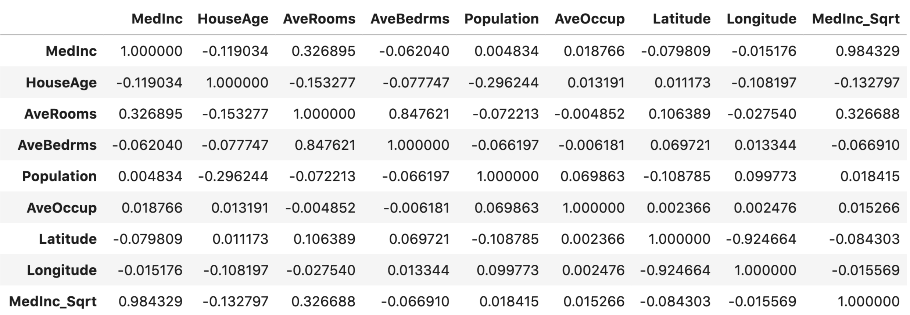

# 特征选择

当你创建了成千上万个特征后，就该从中挑选出几个了。但是，我们绝不应该创建成百上千个无用的特征。特征过多会带来一个众所周知的问题，即 "维度诅咒"。如果你有很多特征，你也必须有很多训练样本来捕捉所有特征。什么是 "大量 "并没有正确的定义，这需要您通过正确验证您的模型和检查训练模型所需的时间来确定。

选择特征的最简单方法是**删除方差非常小的特征**。如果特征的方差非常小（即非常接近于 0），它们就接近于常量，因此根本不会给任何模型增加任何价值。最好的办法就是去掉它们，从而降低复杂度。请注意，方差也取决于数据的缩放。 Scikit-learn 的 VarianceThreshold 实现了这一点。

```python
from sklearn.feature_selection import VarianceThreshold
data = ...
# 创建 VarianceThreshold 对象 var_thresh，指定方差阈值为 0.1
var_thresh = VarianceThreshold(threshold=0.1)
# 使用 var_thresh 对数据 data 进行拟合和变换，将方差低于阈值的特征移除
transformed_data = var_thresh.fit_transform(data)
```

我们还可以删除相关性较高的特征。要计算不同数字特征之间的相关性，可以使用皮尔逊相关性。

```python
import pandas as pd
from sklearn.datasets import fetch_california_housing
# 加载数据
data = fetch_california_housing() 
# 从数据集中提取特征矩阵 X
X = data["data"]
# 从数据集中提取特征的列名
col_names = data["feature_names"] 
# 从数据集中提取目标变量 y
y = data["target"]
df = pd.DataFrame(X, columns=col_names)
# 添加 MedInc_Sqrt 列，是 MedInc 列中每个元素进行平方根运算的结果
df.loc[:, "MedInc_Sqrt"] = df.MedInc.apply(np.sqrt) 
# 计算皮尔逊相关性矩阵
df.corr()
```

得出相关矩阵，如图 1 所示。



<p align="center"><b>图 1：皮尔逊相关矩阵样本</b> </p>

我们看到，MedInc_Sqrt 与 MedInc 的相关性非常高。因此，我们可以删除其中一个特征。

现在我们可以转向一些**单变量特征选择方法**。单变量特征选择只不过是针对给定目标对每个特征进行评分。**互信息**、**方差分析 F 检验和 chi2** 是一些最常用的单变量特征选择方法。在 scikit- learn 中，有两种方法可以使用这些方法。
- SelectKBest：保留得分最高的 k 个特征
- SelectPercentile：保留用户指定百分比内的顶级特征。

必须注意的是，只有非负数据才能使用 chi2。在自然语言处理中，当我们有一些单词或基于 tf-idf 的特征时，这是一种特别有用的特征选择技术。最好为单变量特征选择创建一个包装器，几乎可以用于任何新问题。

```python
from sklearn.feature_selection import chi2
from sklearn.feature_selection import f_classif
from sklearn.feature_selection import f_regression
from sklearn.feature_selection import mutual_info_classif
from sklearn.feature_selection import mutual_info_regression
from sklearn.feature_selection import SelectKBest
from sklearn.feature_selection import SelectPercentile
class UnivariateFeatureSelction:
    def __init__(self, n_features, problem_type, scoring): 
        # 若问题类型是分类问题
        if problem_type == "classification": 
            # 创建字典 valid_scoring ，包含各种特征重要性衡量方式
            valid_scoring = {
                "f_classif": f_classif, 
                "chi2": chi2,
                "mutual_info_classif": mutual_info_classif 
            }
        # 若问题类型是回归问题
        else:
            # 创建字典 valid_scoring，包含各种特征重要性衡量方式
            valid_scoring = {
                "f_regression": f_regression,
                "mutual_info_regression": mutual_info_regression 
            }
        # 检查特征重要性方式是否在字典中
		if scoring not in valid_scoring:
            raise Exception("Invalid scoring function")
        
        # 检查 n_features 的类型，如果是整数，则使用 SelectKBest 进行特征选择
		if isinstance(n_features, int):
            self.selection = SelectKBest( 
                valid_scoring[scoring], 
                k=n_features
            )
        # 如果 n_features 是浮点数，则使用 SelectPercentile 进行特征选择
		elif isinstance(n_features, float): 
			self.selection = SelectPercentile(
                valid_scoring[scoring], 
                percentile=int(n_features * 100)
            )
        # 如果 n_features 类型无效，引发异常
		else:
			raise Exception("Invalid type of feature")

    # 定义 fit 方法，用于拟合特征选择器
	def fit(self, X, y):
		return self.selection.fit(X, y) 
    
    # 定义 transform 方法，用于对数据进行特征选择转换
	def transform(self, X):
		return self.selection.transform(X)
    
      # 定义 fit_transform 方法，用于拟合特征选择器并同时进行特征选择转换
    def fit_transform(self, X, y):
		return self.selection.fit_transform(X, y)
```

使用该类非常简单。

```python
# 实例化特征选择器，保留前10%的特征，回归问题，使用f_regression衡量特征重要性
ufs = UnivariateFeatureSelction(n_features=0.1,
                                problem_type="regression", 
                                scoring="f_regression"
                               )
# 拟合特征选择器
ufs.fit(X, y)
# 特征转换
X_transformed = ufs.transform(X)
```


这样就能满足大部分单变量特征选择的需求。请注意，创建较少而重要的特征通常比创建数以百计的特征要好。单变量特征选择不一定总是表现良好。大多数情况下，人们更喜欢使用机器学习模型进行特征选择。让我们来看看如何做到这一点。

使用模型进行特征选择的最简单形式被称为贪婪特征选择。在贪婪特征选择中，第一步是选择一个模型。第二步是选择损失/评分函数。第三步也是最后一步是反复评估每个特征，如果能提高损失/评分，就将其添加到 "好 "特征列表中。没有比这更简单的了。但你必须记住，这被称为贪婪特征选择是有原因的。这种特征选择过程在每次评估特征时都会适合给定的模型。这种方法的计算成本非常高。完成这种特征选择也需要大量时间。如果不正确使用这种特征选择，甚至会导致模型过度拟合。

让我们来看看它是如何实现的。

```python
import pandas as pd
from sklearn import linear_model
from sklearn import metrics
from sklearn.datasets import make_classification
class GreedyFeatureSelection: 
    
    # 定义评估分数的方法，用于评估模型性能
    def evaluate_score(self, X, y): 
        # 逻辑回归模型
        model = linear_model.LogisticRegression() 
        # 训练模型
        model.fit(X, y)
        # 预测概率值
        predictions = model.predict_proba(X)[:, 1] 
        # 计算 AUC 分数
        auc = metrics.roc_auc_score(y, predictions) 
        return auc
    
    # 特征选择函数
	def _feature_selection(self, X, y): 
        # 初始化空列表，用于存储最佳特征和最佳分数
        good_features = []
        best_scores = []
        # 获取特征数量
        num_features = X.shape[1]
        
        # 开始特征选择的循环
        while True:
            this_feature = None
            best_score = 0
        
            # 遍历每个特征
            for feature in range(num_features):
                if feature in good_features: 
                    continue
                selected_features = good_features + [feature]
                xtrain = X[:, selected_features]
                score = self.evaluate_score(xtrain, y)

                # 如果当前特征的得分优于之前的最佳得分，则更新
                if score > best_score:
                    this_feature = feature 
                    best_score = score
            
            # 若找到了新的最佳特征
            if this_feature != None:
                # 特征添加到 good_features 列表
                good_features.append(this_feature) 
                # 得分添加到 best_scores 列表
                best_scores.append(best_score)
            # 如果 best_scores 列表长度大于2，并且最后两个得分相比较差，则结束循环
            if len(best_scores) > 2:
                if best_scores[-1] < best_scores[-2]: 
                    break
        # 返回最佳特征的得分列表和最佳特征列表
		return best_scores[:-1], good_features[:-1]

    # 定义类的调用方法，用于执行特征选择
    def __call__(self, X, y): 
        scores, features = self._feature_selection(X, y)
        return X[:, features], scores

if __name__ == "__main__":
    # 生成一个示例的分类数据集 X 和标签 y
    X, y = make_classification(n_samples=1000, n_features=100) 
    # 实例化 GreedyFeatureSelection 类，并使用 __call__ 方法进行特征选择
    X_transformed, scores = GreedyFeatureSelection()(X, y)
```

这种贪婪特征选择方法会返回分数和特征索引列表。图 2 显示了在每次迭代中增加一个新特征后，分数是如何提高的。我们可以看到，在某一点之后，我们就无法提高分数了，这就是我们停止的地方。

另一种贪婪的方法被称为递归特征消除法（RFE）。在前一种方法中，我们从一个特征开始，然后不断添加新的特征，但在 RFE 中，我们从所有特征开始，在每次迭代中不断去除一个对给定模型提供最小值的特征。但我们如何知道哪个特征的价值最小呢？如果我们使用线性支持向量机（SVM）或逻辑回归等模型，我们会为每个特征得到一个系数，该系数决定了特征的重要性。而对于任何基于树的模型，我们得到的是特征重要性，而不是系数。在每次迭代中，我们都可以剔除最不重要的特征，直到达到所需的特征数量为止。因此，我们可以决定要保留多少特征。


<p align="center"><b>图 2：增加新特征后，贪婪特征选择的 AUC 分数如何变化</b> </p>

当我们进行递归特征剔除时，在每次迭代中，我们都会剔除特征重要性较高的特征或系数接近 0 的特征。请记住，当你使用逻辑回归这样的模型进行二元分类时，如果特征对正分类很重要，其系数就会更正，而如果特征对负分类很重要，其系数就会更负。修改我们的贪婪特征选择类，创建一个新的递归特征消除类非常容易，但 scikit-learn 也提供了 RFE。下面的示例展示了一个简单的用法。

```python
import pandas as pd
from sklearn.feature_selection import RFE
from sklearn.linear_model import LinearRegression
from sklearn.datasets import fetch_california_housing
data = fetch_california_housing() 
X = data["data"]
col_names = data["feature_names"]
y = data["target"]
model = LinearRegression()
# 创建 RFE（递归特征消除），指定模型为线性回归模型，要选择的特征数量为 3
rfe = RFE(
    estimator=model,
    n_features_to_select=3 
)
# 训练模型
rfe.fit(X, y)
# 使用 RFE 选择的特征进行数据转换
X_transformed = rfe.transform(X)
```

我们看到了从模型中选择特征的两种不同的贪婪方法。但也可以根据数据拟合模型，然后通过特征系数或特征的重要性从模型中选择特征。如果使用系数，则可以选择一个阈值，如果系数高于该阈值，则可以保留该特征，否则将其剔除。

让我们看看如何从随机森林这样的模型中获取特征重要性。

```python
import pandas as pd
from sklearn.datasets import load_diabetes
from sklearn.ensemble import RandomForestRegressor 
data = load_diabetes() 
X = data["data"]
col_names = data["feature_names"] 
y = data["target"]
# 实例化随机森林模型
model = RandomForestRegressor()
# 拟合模型
model.fit(X, y)
```

随机森林（或任何模型）的特征重要性可按如下方式绘制。

```python
# 获取特征重要性
importances = model.feature_importances_
# 降序排列
idxs = np.argsort(importances)
# 设定标题
plt.title('Feature Importances')
# 创建直方图
plt.barh(range(len(idxs)), importances[idxs], align='center')
# y轴标签
plt.yticks(range(len(idxs)), [col_names[i] for i in idxs])
# x轴标签
plt.xlabel('Random Forest Feature Importance')
plt.show()
```

结果如图 3 所示。


<p align="center"><b>图 3：特征重要性图</b> </p>

从模型中选择最佳特征并不是什么新鲜事。您可以从一个模型中选择特征，然后使用另一个模型进行训练。例如，你可以使用逻辑回归系数来选择特征，然后使用随机森林（Random Forest）对所选特征进行模型训练。Scikit-learn 还提供了 SelectFromModel 类，可以帮助你直接从给定的模型中选择特征。您还可以根据需要指定系数或特征重要性的阈值，以及要选择的特征的最大数量。

请看下面的代码段，我们使用 SelectFromModel 中的默认参数来选择特征。

```python
import pandas as pd
from sklearn.datasets import load_diabetes
from sklearn.ensemble import RandomForestRegressor
from sklearn.feature_selection import SelectFromModel
data = load_diabetes() 
X = data["data"]
col_names = data["feature_names"] 
y = data["target"]
# 创建随机森林模型回归模型
model = RandomForestRegressor()
# 创建 SelectFromModel 对象 sfm，使用随机森林模型作为估算器
sfm = SelectFromModel(estimator=model) 
# 使用 sfm 对特征矩阵 X 和目标变量 y 进行特征选择
X_transformed = sfm.fit_transform(X, y)
# 获取经过特征选择后的特征掩码（True 表示特征被选择，False 表示特征未被选择）
support = sfm.get_support()
# 打印被选择的特征列名
print([x for x, y in zip(col_names, support) if y == True ])
```

上面程序打印结果： ['bmi'，'s5']。我们再看图 3，就会发现这是最重要的两个特征。因此，我们也可以直接从随机森林提供的特征重要性中进行选择。我们还缺少一件事，那就是使用 **L1（Lasso）惩罚模型**进行特征选择。当我们使用 L1 惩罚进行正则化时，大部分系数都将为 0（或接近 0），因此我们要选择系数不为 0 的特征。只需将模型选择片段中的随机森林替换为支持 L1 惩罚的模型（如 lasso 回归）即可。所有基于树的模型都提供特征重要性，因此本章中展示的所有基于模型的片段都可用于 XGBoost、LightGBM 或 CatBoost。特征重要性函数的名称可能不同，产生结果的格式也可能不同，但用法是一样的。最后，在进行特征选择时必须小心谨慎。在训练数据上选择特征，并在验证数据上验证模型，以便在不过度拟合模型的情况下正确选择特征。